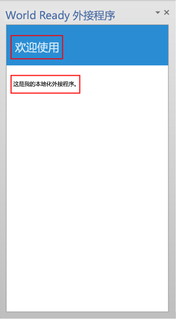
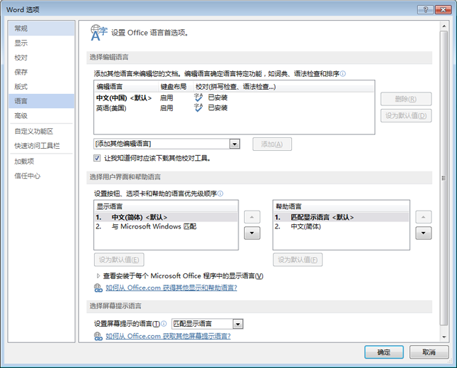

# <a name="localization-for-office-add-ins"></a>Office 外接程序的本地化

您可以实现适合 Office 外接程序的任何本地化方案。Office 外接程序平台的 JavaScript API 和清单架构提供了一些选择。可以使用适用于 Office 的 JavaScript API 确定区域设置并根据主机应用程序的区域设置显示字符串，或根据数据的区域设置解释或显示数据。可以使用清单指定区域设置特定的加载项文件位置和描述性信息。也可以使用 Microsoft Ajax 脚本支持全球化和本地化。

## <a name="use-the-javascript-api-to-determine-locale-specific-strings"></a>使用 JavaScript API 确定区域设置特定的字符串

适用于 Office 的 JavaScript API 提供两个属性，支持显示或解释与主机应用程序和数据的区域设置一致的值：


- [Context.displayLanguage][displayLanguage] 指定主机应用程序用户界面的区域设置（或语言）。以下示例验证主机应用程序是否使用 en-US 或 fr-Fr 区域设置，并显示特定区域设置的问候语。

    
```js
      function sayHelloWithDisplayLanguage() {
        var myLanguage = Office.context.displayLanguage;
        switch (myLanguage) {
            case 'en-US':
                write('Hello!');
                break;
            case 'fr-FR':
                write('Bonjour!');
                break;
        }
    }
    // Function that writes to a div with id='message' on the page.
        function write(message){
        document.getElementById('message').innerText += message; 
     }

```

- [Context.contentLanguage][contentLanguage] 指定数据的区域设置（或语言）。展开上一个代码示例，不检查 [displayLanguage] 属性，而是将 `myLanguage` 分配给 [contentLanguage] 属性，并使用相同代码的其余部分根据数据的区域设置显示问候语：
    
```js
      var myLanguage = Office.context.contentLanguage;
```


## <a name="control-localization-from-the-manifest"></a>从清单中控制本地化


每个 Office 外接程序在其清单中指定一个 [DefaultLocale] 元素和区域设置。默认情况下，Office 外接程序平台和 Office 主机应用程序将 [Description]、[DisplayName]、[IconUrl]、[HighResolutionIconUrl] 和 [SourceLocation] 元素的值应用于所有的区域设置。可以通过为每个其他区域设置的上述五个元素中的任意一个指定 [Override] 子元素来选择支持将特定值用于特定的区域设置。[DefaultLocale] 元素和 [Override] 元素的 `Locale` 属性的值根据 [RFC 3066]（“用于语言标识的标记”）指定。表 1 描述了这些元素的本地化支持。

**表 1.本地化支持**


|**元素**|**本地化支持**|
|:-----|:-----|
|[说明]   |你指定的每个区域设置中的用户可以在 Office 应用商店（或专有目录）中看到本地化的外接程序说明。<br/>对于 Outlook 外接程序，安装后，用户可以在 Exchange 管理中心 (EAC) 中看到说明。|
|[DisplayName]   |你指定的每个区域设置中的用户可以在 Office 应用商店（或专有目录）中看到本地化的外接程序说明。<br/>对于 Outlook 外接程序，安装后，用户可以看到显示名称显示为 Outlook 外接程序按钮的标签，也可以在 EAC 中看到显示名称。<br/>对于内容和任务窗格外接程序，安装外接程序后，用户可以在功能区中看到该显示名称。|
|[IconUrl]        |图标图像是可选的。可以使用相同的替代方法为特定区域性指定特定图像。如果使用并本地化图标，则您指定的每个区域设置中的用户均可看到该加载项的本地化图标图像。<br/>对于 Outlook 外接程序，安装外接程序后，用户可以在 EAC 中看到该图标。<br/>对于内容和任务窗格外接程序，安装外接程序后，用户可以在功能区中看到该图标。|
|[HighResolutionIconUrl] <br/><br/>**重要说明**  此元素仅适用于使用外接程序清单版本 1.1 的情况。|高分辨率图标图像是可选的，但一旦指定，则必须在  [IconUrl] 元素之后出现。指定 [HighResolutionIconUrl] 且在支持高 DPI 分辨率的设备上安装了加载项后，将使用 [HighResolutionIconUrl] 值而不是 [IconUrl] 值。<br/>图标图像是可选的。可以使用相同的替代方法为特定区域性指定特定图像。如果使用并本地化图标，则您指定的每个区域设置中的用户均可看到该加载项的本地化图标图像。<br/>对于 Outlook 外接程序，安装外接程序后，用户可以在 EAC 中看到该图标。<br/>对于内容和任务窗格外接程序，安装外接程序后，用户可以在功能区中看到该图标。|
|[SourceLocation]   |指定的每个区域设置中的用户都可以看到专门针对该区域设置为该外接程序设计的网页。 |

 > 
  **注意：**你只能本地化 Office 支持的区域设置的说明和显示名称。请参阅 [ Office 2013 中的语言标识符和 OptionState ID 值](http://technet.microsoft.com/en-us/library/cc179219.aspx)获取 Office 最新版本的语言和区域设置列表。


### <a name="examples"></a>示例

例如，Office 外接程序可以将  [DefaultLocale] 指定为 `en-us`。对于  [DisplayName] 元素，加载项可以为区域设置 `fr-fr` 指定 [Override] 子元素，如下所示。 


```xml
<DefaultLocale>en-us</DefaultLocale>
...
<DisplayName DefaultValue="Video player">
    <Override Locale="fr-fr" Value="Lecteur vidéo" />
</DisplayName>
```

这意味着，加载项默认情况下采用 `en-us` 区域设置。除非客户端计算机的区域设置为 `fr-fr`（此时用户将看到法语的显示名称“Lecteur vidéo”），否则对于所有区域设置，用户都将看到英文显示名称“Video player”。

> **注意：**每种语言只可指定单一的覆盖，包括对于默认区域设置的覆盖。例如，如果默认区域设置为 `en-us`，则无法也指定 `en-us` 的覆盖。 

以下示例对  [Description] 元素应用区域设置覆盖。它首先指定默认区域设置 `en-us` 和英文说明，然后指定 [Override] 语句，其中包含 `fr-fr` 区域设置的法语说明：

```xml
<DefaultLocale>en-us</DefaultLocale>
...
<Description DefaultValue=
   "Watch YouTube videos referenced in the emails you receive 
   without leaving your email client.">
   <Override Locale="fr-fr" Value=
   "Visualisez les vidéos YouTube référencées dans vos courriers 
   électronique directement depuis Outlook et Outlook Web App."/>
</Description>
```

这意味着，外接程序在默认情况下采用 `en-us` 区域设置。除非客户端计算机的区域设置为 `fr-fr`（此时用户将看到法语说明），否则对于所有区域设置，用户都将看到 `DefaultValue` 属性中的英文说明。

在以下示例中，加载项指定更适合  `fr-fr` 区域设置和区域性的不同图像。默认情况下，用户会看到图像 DefaultLogo.png，客户端计算机的区域设置为 `fr-fr` 时除外。此时，用户将看到图像 FrenchLogo.png。 


```xml
<!-- Replace "domain" with a real web server name and path. -->
<IconUrl DefaultValue="https://<domain>/DefaultLogo.png"/>
    <Override Locale="fr-fr" Value="https://<domain>/FrenchLogo.png"/>
```

对于  [SourceLocation] 元素，支持其他区域设置意味着为每个指定的区域设置提供单独的源 HTML 文件。您指定的每个区域设置中的用户可以看到您为该区域设置设计的自定义网页。

对于 Outlook 外接程序， [SourceLocation] 元素还与设备类型保持一致。这使您可为每个对应的设备类型提供单独的本地化源 HTML 文件。可在每个适用的设置元素（ [DesktopSettings]、 [TabletSettings] 或 [PhoneSettings]）中指定一个或多个  [Override] 子元素。以下示例显示用于台式机、平板电脑和 Smartphone 设备的设置元素，每个元素分别具有一个用于默认区域设置的 HTML 文件和一个用于法语区域设置的 HTML 文件。


```xml
<DesktopSettings>
   <SourceLocation DefaultValue="https://contoso.com/Desktop.html">
      <Override Locale="fr-fr" Value="https://contoso.com/fr/Desktop.html" />
   </SourceLocation>
   <RequestedHeight>250</RequestedHeight>
</DesktopSettings>
<TabletSettings>
   <SourceLocation DefaultValue="https://contoso.com/Tablet.html">
      <Override Locale="fr-fr" Value="https://contoso.com/fr/Tablet.html" />
   </SourceLocation>
   <RequestedHeight>200</RequestedHeight>
</TabletSettings>
<PhoneSettings>
   <SourceLocation DefaultValue="https://contoso.com/Mobile.html">
      <Override Locale="fr-fr" Value="https://contoso.com/fr/Mobile.html" />
   </SourceLocation>

</PhoneSettings>

```


## <a name="match-date/time-format-with-client-locale"></a>将日期/时间格式与客户端区域设置匹配


可以通过 [displayLanguage] 属性获取主机应用程序用户界面的区域位置。然后可以显示格式与主机应用程序中的当前区域位置一致的日期和时间值。执行上述操作的一种方法是准备一个指定日期/时间显示格式的资源文件以用于 Office 外界程序支持的各个区域设置。在运行时，外接程序可以使用该资源文件并匹配通过 [displayLanguage] 获得的区域设置正确的日期/时间格式。

可以通过使用 [contentLanguage] 属性获取主机应用程序数据的区域设置。基于此值，可以正确地解读或显示日期/时间字符串。例如，`jp-JP` 区域设置将数据/时间值表示为 `yyyy/MM/dd`，而 `fr-FR` 区域设置则表示为 `dd/MM/yyyy`。


## <a name="use-ajax-for-globalization-and-localization"></a>将 Ajax 用于全球化和本地化


如果使用 Visual Studio 创建 Office 外接程序，.NET Framework 和 Ajax 会提供用于全球化和本地化客户端脚本文件的方法。

您可以全球化 Office 外接程序并在其 JavaScript 代码中使用 [Date](http://msdn.microsoft.com/library/caf98d32-2de2-4704-8198-692350343681.aspx) 和 [Number](http://msdn.microsoft.com/library/c216d3a1-12ae-47d1-bca1-c3666d04572f.aspx) JavaScript 类型扩展和 JavaScript [Date](http://msdn.microsoft.com/library/ce2202bb-7ec9-4f5a-bf48-3a04feff283e.aspx) 对象，以根据当前浏览器的区域设置显示值。有关详细信息，请参阅 [Walkthrough: Globalizing a Date by Using Client Script](http://msdn.microsoft.com/library/69b34e6d-d590-4d03-a763-b7ae54b47d74.aspx)。

可将本地化的资源字符串直接包含在独立的 JavaScript 文件中，以便为不同区域设置提供客户端脚本文件，这些文件在浏览器中设置或由用户提供。为每个受支持的区域设置创建单独的脚本文件。在每个脚本文件中，包括一个 JSON 格式的对象，其中包含用于该区域设置的资源字符串。在浏览器中运行脚本时，会应用本地化的值。 


## <a name="example:-build-a-localized-office-add-in"></a>示例：生成本地化 Office 加载项


本节提供示例，演示如何本地化 Office 外接程序描述、显示名称和 UI。

若要运行所提供的示例代码，请在计算机上配置 Microsoft Office 2013 以使用其他语言，这样您就可以通过切换用于显示菜单和命令的语言或者切换用于编辑和校对的语言（或同时切换两者）来测试您的加载项。

此外，您将需要创建 Visual Studio 2015 Office 外接程序项目。


 > **注意：**  若要下载 Visual Studio 2015，请参阅 [Office 开发人员工具页](https://www.visualstudio.com/features/office-tools-vs)。此页还包含指向 Office 开发人员工具的链接。

### <a name="configure-office-2013-to-use-additional-languages-for-display-or-editing"></a>配置 Office 2013 以使用用于显示或编辑的其他语言

您可以使用 Office 2013 语言包安装其他语言。有关语言包及其获取位置的详细信息，请参阅 [Office 2013 语言选项](http://office.microsoft.com/en-us/language-packs/)。


 > **注意：**如果你是一位 MSDN 订阅者，则可能已具有适用于你的 Office 2013 语言包。若要确定你的订阅是否提供可供下载的 Office 2013 语言包，请转至 [MSDN 订阅主页](https://msdn.microsoft.com/subscriptions/manage/)，在“**软件下载**”中输入“Office 2013 语言包”，选择“**搜索**”，然后选择“**我的订阅可用的产品**”。在“**语言**”下，选中想要下载的语言包的复选框，然后选择“**转到**” 

安装语言包后，您可以配置 Office 2013 以使用安装的语言在 UI 中显示或编辑文档内容，或同时用于两者。本文中的示例使用的是应用了西班牙语语言包的 Office 2013 的安装。


### <a name="create-an-office-add-in-project"></a>创建 Office 加载项项目


1. 在 Visual Studio 中，依次选择“**文件**” > “**新建项目**”。
    
2. 在“**新建项目**”对话框中的“**模版**”下，展开“**Visual Basic**”或“**Visual C#**”，展开“**Office/SharePoint**”，然后选择“**Office 外接程序**”。
    
3. 选择“**Office 外接程序**”，然后为你的外接程序命名，例如 WorldReadyAddIn。选择“**确定**”。
    
4. 在“**创建 Office 外接程序**”对话框中，选择“**任务窗格**”，然后选择“**下一步**”。在下一个页面，将除 Word 之外的所有主机应用程序的复选框清除。选择“**完成**”以创建项目。
    

### <a name="localize-the-text-used-in-your-add-in"></a>本地化你的外接程序中使用的文本


您要本地化为另一种语言的文本出现在两个区域中：


-  **加载项显示名称和说明** 。这是受应用程序清单文件中的条目控制的。
    
-  **加载项 UI** 。您可以通过使用 JavaScript 代码本地化在您的加载项 UI 中出现的字符串（例如，通过使用包含本地化后字符串的单独资源文件）。
    
若要本地化加载项显示名称和说明，请执行以下操作：


1. 在“**解决方案资源管理器**”中，展开“**WorldReadyAddIn**”、“**WorldReadyAddInManifest**”，然后选择“**WorldReadyAddIn.xml**”。
    
2. 在 WorldReadyAddInManifest.xml 中，将“[DisplayName]”和“[Description]”元素替换为以下代码块：
    
     > **注意：**  对于本示例中使用的西班牙语本地化字符串的 [DisplayName] 和 [Description] 元素，你可以替换为任何其他语言的本地化字符串。

```xml
      <DisplayName DefaultValue="World Ready add-in">
        <Override Locale="es-es" Value="Aplicación de uso internacional"/>
      </DisplayName>
      <Description DefaultValue="An add-in for testing localization">
        <Override Locale="es-es" Value="Una aplicación para la prueba de la localización"/>
      </Description>
```

3. 例如，如果您将 Office 2013 的显示语言从英语切换到西班牙语，然后运行加载项，加载项的显示名称和说明将用本地化文本显示。 
    
若要设计加载项 UI 的布局，请执行以下操作：


1. 在 Visual Studio 中的“**解决方案资源管理器**”中，选择“**Home.html**”。
    
2. 将 Home.html 中的 HTML 替换为以下 HTML。
    
```html
    <!DOCTYPE html>
    <html>
    <head>
        <meta charset="UTF-8" />
        <meta http-equiv="X-UA-Compatible" content="IE=Edge" />
        <title></title>
        <script src="../../Scripts/jquery-1.8.2.js" type="text/javascript"></script>
    
        <link href="../../Content/Office.css" rel="stylesheet" type="text/css" />
        <script src="https://appsforoffice.microsoft.com/lib/1/hosted/office.js" type="text/javascript"></script>
    
        <!-- To enable offline debugging using a local reference to Office.js, use:                        -->
        <!-- <script src="../../Scripts/Office/MicrosoftAjax.js" type="text/javascript"></script>          -->
        <!--    <script src="../../Scripts/Office/1.0/office.js" type="text/javascript"></script>          -->
    
        <link href="../App.css" rel="stylesheet" type="text/css" />
        <script src="../App.js" type="text/javascript"></script>
    
        <link href="Home.css" rel="stylesheet" type="text/css" />
        <script src="Home.js" type="text/javascript"></script> <body>
        <!-- Page content -->
        <div id="content-header">
            <div class="padding">
                <h1 id="greeting"></h1>
            </div>
        </div>
        <div id="content-main">
            <div class="padding">
                <div>
                    <p id="about"></p>
                </div>            
            </div>
        </div>
    </head>
    </html>
```

3. 在 Visual Studio 中，选择“**文件**”、“**保存 AddIn\Home\Home.html**”。
    
图 3 显示了示例外接程序运行时将显示本地化文本的标题 (h1) 元素和段落 (p) 元素。

**图 3：外接程序 UI**




#### <a name="add-the-resource-file-that-contains-the-localized-strings"></a>添加包含本地化后字符串的资源文件


JavaScript 资源文件包含用于加载项 UI 的字符串。示例加载项 UI 有一个用于显示问候语的 h1 元素，和一个用于向用户介绍该加载项的 p 元素。 

若要为标题和段落启用本地化字符串，您需要将字符串放在一个单独的资源文件中。资源文件会创建一个 JavaScript 对象，对每组本地化字符串来说，它都包含一个单独的 JavaScript 对象表示法 (JSON) 对象。资源文件也提供为给定区域设置找回适当 JSON 对象的方法。 

若要将资源文件添加到加载项项目，请执行以下操作：


1. 在 Visual Studio 中的“**解决方案资源管理器**”中，选择示例外接程序的 Web 项目中的“**外接程序**”文件夹，然后选择“**添加**” > “**JavaScript 文件**”。
    
2. 在“**指定项名称**”对话框中，输入 UIStrings.js。
    
3. 将以下代码添加到 UIStrings.js 文件。

```js
      /* Store the locale-specific strings */
    
    var UIStrings = (function ()
    {
        "use strict";
    
        var UIStrings = {};
    
        // JSON object for English strings
        UIStrings.EN =
        {        
            "Greeting": "Welcome",
            "Introduction": "This is my localized add-in."        
        };
    
    
        // JSON object for Spanish strings
        UIStrings.ES =
        {        
            "Greeting": "Bienvenido",
            "Introduction": "Esta es mi aplicación localizada."
        };
    
        UIStrings.getLocaleStrings = function (locale)
        {
            var text;
            
            // Get the resource strings that match the language.
            switch (locale)
            {
                case 'en-US':
                    text = UIStrings.EN;
                    break;
                case 'es-ES':
                    text = UIStrings.ES;
                    break;
                default:
                    text = UIStrings.EN;
                    break;
            }
    
            return text;
        };
    
        return UIStrings;
    })();
```

UIStrings.js 资源文件将创建一个对象  **UIStrings**，其中包含加载项 UI 的本地化字符串。 

#### <a name="localize-the-text-used-for-the-add-in-ui"></a>本地化用于加载项 UI 的文本


若要在加载项中使用资源文件，您需要在 Home.html 上为它添加一个脚本标记。当加载 Home.html 时，UIStrings.js 开始执行，同时您的代码也可以访问您用于获取字符串的  **UIStrings** 对象。在 Home.html 的头标记中添加以下 HTML 以使 **UIStrings** 对您的代码可用。


```html
<!-- Resource file for localized strings:                                                          -->
<script src="../UIStrings.js" type="text/javascript"></script>
```

现在，您可以使用  **UIStrings** 对象为您的加载项 UI 设置字符串了。

如果您要根据显示主机应用程序中的菜单和命令所用的语言来更改您的加载项的本地化，可以使用  **Office.context.displayLanguage** 属性获取该语言的区域设置。例如，如果主机应用程序语言使用西班牙语显示菜单和命令，那么 **Office.context.displayLanguage** 属性将返回语言代码 es-ES。

如果您要根据编辑文档内容所用的语言更改您的加载项的本地化，可以使用  **Office.context.contentLanguage** 属性获取该语言的区域设置。例如，如果主机应用程序语言使用西班牙语编辑文档内容， **Office.context.contentLanguage** 属性将返回语言代码 es-ES。

确定主机应用程序使用的语言后，您可以使用  **UIStrings** 获取与主机应用程序语言相匹配的本地化字符串组。

用以下代码替换 Home.js 文件中的代码。以下代码显示您可以如何基于主机应用程序的显示语言或主机应用程序的编辑语言更改 Home.html 上 UI 元素中使用的字符串。


 > **注意：**  要根据编辑所使用的语言在更改加载项本地化之间进行切换，请取消注释代码行 `var myLanguage = Office.context.contentLanguage;` 并注释掉代码行 `var myLanguage = Office.context.displayLanguage;`


```js
/// <reference path="../App.js" />
/// <reference path="../UIStrings.js" />


(function () {
    "use strict";

    // The initialize function must be run each time a new page is loaded.
    Office.initialize = function (reason)
    {
       
        $(document).ready(function () {
            app.initialize();

            // Get the language setting for editing document content.
            // To test this, uncomment the following line and then comment out the
            // line that uses Office.context.displayLanguage.
            // var myLanguage = Office.context.contentLanguage;

            // Get the language setting for UI display in the host application.
            var myLanguage = Office.context.displayLanguage;            
            var UIText;

            // Get the resource strings that match the language.
            // Use the UIStrings object from the UIStrings.js file
            // to get the JSON object with the correct localized strings.
            UIText = UIStrings.getLocaleStrings(myLanguage);            

            // Set localized text for UI elements.
            $("#greeting").text(UIText.Greeting);
            $("#about").text(UIText.Instruction);
        });
    };    
})();
```


### <a name="test-your-localized-add-in"></a>测试本地化的加载项


若要测试本地化加载项，请更改在主机应用程序中用于显示或编辑的语言，然后运行加载项。 

若要更改外接程序中用于显示或编辑的语言，请执行以下操作：


1. 在 Word 2013，依次选择“**文件**”、“**选项**”和“**语言**”。图 4 显示打开了“语言”选项卡的“**Word 选项**”对话框。
    
    **图 4：“Word 2013 选项”对话框中的“语言”选项**

    

2. 在“**选择用户界面和帮助语言**”下，选择想要显示的语言，例如西班牙语，然后选择向上箭头键将西班牙语移至列表中的第一个位置。或者，若要更改编辑时使用的语言，在“**选择编辑语言**下，选择编辑时想要使用的语言，例如西班牙语，然后选择“**设置为默认值**。
    
3. 选择“**确定**”确认选择，然后关闭 Word。
    
运行示例外接程序。任务窗格外接程序将在 Word 2013 中加载，同时更改外接程序 UI 中的字符串以匹配主机应用程序使用的语言，如图 5 所示。


**图 5.使用本地化文本的外接程序 UI**


## <a name="additional-resources"></a>其他资源

- [Office 外接程序的设计准则](../../docs/design/add-in-design.md)
    
- 
  [Office 2013 中的语言标识符和 OptionState Id 值](http://technet.microsoft.com/en-us/library/cc179219%28Office.15%29.aspx)

[DefaultLocale]:         ../../reference/manifest/defaultlocale.md
[说明]:           ../../reference/manifest/description.md
[DisplayName]:           ../../reference/manifest/displayname.md
[IconUrl]:               ../../reference/manifest/iconurl.md
[HighResolutionIconUrl]: ../../reference/manifest/highresolutioniconurl.md
[SourceLocation]:        ../../reference/manifest/sourcelocation.md
[替代]:              ../../reference/manifest/override.md
[DesktopSettings]:       ../../reference/manifest/desktopsettings.md
[TabletSettings]:        ../../reference/manifest/tabletsettings.md
[PhoneSettings]:         ../../reference/manifest/phonesettings.md
[displayLanguage]:  ../../reference/shared/office.context.displaylanguage.md 
[contentLanguage]:  ../../reference/shared/office.context.contentlanguage.md 
[RFC 3066]: http://www.ietf.org/rfc/rfc3066.txt