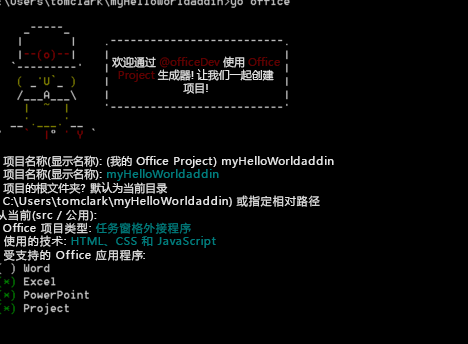

# <a name="create-an-office-add-in-using-any-editor"></a>使用任何编辑器创建 Office 外接程序

可对你的 Office 外接程序使用 Yeoman 生成器。Yeoman 生成器可提供项目基架并生成管理。`manifest.xml` 文件告知 Office 应用程序你的外接程序所在的位置以及希望其显示的方式。Office 应用程序负责将其托管在 Office 内。

 >**注意：**这些说明使用 Windows 命令提示符，但也适用于其他 shell 环境。 


## <a name="prerequisites-for-yeoman-generator"></a>Yeoman 生成器的先决条件

若要运行 Yeoman Office 生成器，需要以下各项：


- [Git](https://git-scm.com/downloads)  
- [npm](https://www.nodejs.org/en/download)
- [Bower](http://bower.io/)
- [Yeoman Office 生成器](https://www.npmjs.com/package/generator-office)
- [Gulp](http://gulpjs.com/)
- [TSD](http://definitelytyped.org/tsd/)
    
只有 Git 和 npm 需要进行单独安装。其他都可以使用 npm 安装。

安装 Git 时，除了应选择以下选项之外，还应使用默认设置： 

- 从 Windows 命令提示符使用 Git
- 使用 Windows 的默认控制台窗口
    
使用默认设置安装 npm 。然后，以管理员身份打开命令提示符，并全局安装其他软件：

```
npm install -g bower yo generator-office gulp tsd
```


## <a name="create-the-default-files-for-your-add-in"></a>为外接程序创建默认文件

开发 Office 外接程序前，应首先为你的项目创建文件夹，并从该处运行生成器。Yeoman 生成器运行在要为该项目提供基架的目录中。 

在命令提示符中，移动到要在其中创建项目的父文件夹。然后使用以下命令创建名为 _myHelloWorldaddin_ 的新文件夹并将当前目录更改为此：


```
mkdir myHelloWorldaddin
cd myHelloWorldaddin
```

使用 Yeoman 生成器根据你的选择（Outlook、内容或任务窗格）创建外接程序。本文中介绍的步骤将创建一个任务窗格外接程序。若要运行该生成器，请输入以下指令：


```
yo office
```

生成器将提示输入以下内容： 


- 外接程序的名称 -- 使用 _myHelloWorldaddin_ 
- 项目的根文件夹 - 使用_当前文件夹_
- 外接程序的类型 - 使用_任务窗格_
- 创建外接程序的技术 - 使用 _HTML、CSS&amp; 和 JavaScript_
- 受支持的 Office 应用程序 - 可以选择任何应用程序
    

**有关外接程序的 Yeoman 生成器输入**



这将为外接程序创建结构和基本文件。


## <a name="hosting-your-office-add-in"></a>托管 Office 外接程序

必须通过 HTTPS 使用 Office 外接程序，如果其为 HTTP，则 Office 应用程序将不会作为外接程序加载 Web 应用。若要在本地开发、调试和托管外接程序，则需具有使用 HTTPS 在本地创建并使用 Web 应用的方法。可通过 Gulp（在下一部分中所述）或使用 Azure 创建自托管的 HTTPS 网站。 


### <a name="using-a-self-hosted-https-site"></a>使用自托管的 HTTPS 网站

gulp-webserver 插件创建自托管的 HTTPS 网站。Office 生成器将其添加到 gulpfile.js 作为生成的项目的名为"serve-static"的任务。使用以下语句启动自托管的 webserver： 


```
gulp serve-static
```

这将在 https://localhost:8443 启动 HTTPS 服务器。


## <a name="develop-your-office-add-in"></a>开发 Office 外接程序

可以使用任何文本编辑器来为自定义 Office 外接程序开发文件。


### <a name="javascript-project-support"></a>JavaScript 项目支持

在创建项目时，Office 生成器将创建一个 jsconfig.json 文件。你可以使用该文件推断你项目中的所有 JavaScript 文件，并使你免于包括重复性的 /// <reference path="../App.js" /> 代码块。

了解有关 [JavaScript 语言](https://code.visualstudio.com/docs/languages/javascript#_javascript-projects-jsconfigjson)页面上的 jsconfig.json 文件的详细信息。


### <a name="javascript-intellisense-support"></a>JavaScript 智能感知支持

此外，即使您正在编写普通 JavaScript，您也可以使用 TypeScript 类型定义文件 ( `*.d.ts`) 来提供额外的 IntelliSense 支持。Office 生成器通过对所选的项目使用的所有第三方库的引用将  `tsd.json` 文件添加到创建的文件中。

使用 Yeoman Office 生成器创建了项目后，只需运行以下命令来下载被引用的类型定义文件：


```
tsd install
```


### <a name="create-a-hello-world-office-add-in"></a>创建 Hello World Office 外接程序


在此示例中，将创建一个 Hello World 外接程序。该外接程序的 UI 由一个 HTML 文件提供，该文件还可以提供 JavaScript 编程逻辑。 


### <a name="to-create-the-files-for-a-hello-world-add-in"></a>创建 Hello World 外接程序的文件


- 在项目文件夹中，转到 _[项目文件夹]/app/home_（在该示例中是 myHelloWorldaddin/app/home），打开 home.html，并使用以下提供最少的 HTML 标记集来显示外接程序 UI 的代码替换现有代码。
    
```HTML
        <!DOCTYPE html>  
      <html> 
        <head> 
           <meta charset="UTF-8" /> 
           <meta http-equiv="X-UA-Compatible" content="IE=Edge"/> 
           <link rel="stylesheet" type="text/css" href="program.css" />
         </head> 
   
        <body> 
           <p>Hello World!</p> 
        </body> 
      
       </html> 
```

  
    
- 接下来，在同一文件夹中，打开 home.css 文件并添加以下 CSS 代码。
    
```css
     body 
   { 
        position:relative; 
   } 
   li :hover 
   { 
        text-decoration: underline; 
        cursor:pointer; 
   } 
   h1,h3,h4,p,a,li 
   { 
        font-family: "Segoe UI Light","Segoe UI",Tahoma,sans-serif; 
        text-decoration-color:#4ec724; 
   } 
```
    
- 然后，返回到父项目文件夹并确保名为 manifest-myHelloWorldaddin.xml 的 XML 文件包含以下 XML 代码。
    
     >**重要说明：**`<id>` 标记中的值是 yeoman 生成器生成项目时所创建的 GUID。不要更改 yeoman 生成器为外接程序创建的 GUID。如果主机为 Azure，则 `SourceLocation` 值将为类似 _https:// [name-of-your-web-app].azurewebsites.net/[path-to-add-in]_ 的 URL。如果正在使用自托管选项，则在本示例中，它将为 _https://localhost:8443/[path-to-add-in]_。

```XML
     <?xml version="1.0" encoding="utf-8"?> 
   <OfficeApp xmlns="http://schemas.microsoft.com/office/appforoffice/1.1" 
              xmlns:xsi="http://www.w3.org/2001/XMLSchema-instance" 
              xsi:type="TaskPaneApp"> 
   <Id>[GUID-for-your-add-in]</Id> 
   <Version>1.0</Version> 
   <ProviderName>Microsoft</ProviderName> 
   <DefaultLocale>EN-US</DefaultLocale> 
   <DisplayName DefaultValue="myHelloWorldaddin"/> 
   <Description DefaultValue="My first app."/> 
    
   <Hosts> 
     <Host Name="Document"/> 
     <Host Name="Workbook"/> 
   </Hosts>
    
   <DefaultSettings> 
     <SourceLocation DefaultValue="https://localhost:8443/app/home/home.html"/> 
   </DefaultSettings> 
   
   <Permissions>ReadWriteDocument</Permissions>
    
   </OfficeApp> 
```


### <a name="running-the-add-in-locally"></a>在本地运行外接程序


若要测试本地外接程序，打开浏览器并输入 home.html 文件的 URL。该操作可在 Web 服务器或自托管 HTTPS 网站上执行。如果在本地对其托管，只需将该 URL 键入到浏览器。在该示例中，它是 `https://localhost:8443/app/home/home.html`。 

您将看到一条错误消息，指示"此网站的安全证书有问题。"请选择"继续浏览此网站..."，然后您将看到文本"Hello World!"


 >**注意：**生成的外接程序附带自签名证书和密钥。将这些内容添加到信任的证书颁发机构列表，这样一来，浏览器便不会发出证书警告。如果想要使用自己的自签名证书，请参阅 [gulp-webserver](https://www.npmjs.com/package/gulp-webserver) 文档。有关如何在 OS X Yosemite 中信任证书的信息，请参阅 [OS X Yosemite：如果证书未被接受](https://support.apple.com/kb/PH18677?locale=en_US)。


## <a name="install-the-add-in-for-testing"></a>安装外接程序进行测试

您可以使用旁加载来安装外接程序进行测试：

- [旁加载 Office 外接程序进行测试](../testing/create-a-network-shared-folder-catalog-for-task-pane-and-content-add-ins.md)
- [在 iPad 和 Mac 上旁加载 Office 外接程序进行测试](../testing/sideload-an-office-add-in-on-ipad-and-mac.md)   
- [旁加载 Outlook 外接程序进行测试](../outlook/testing-and-tips.md)
    

## <a name="debugging-your-office-add-in"></a>调试 Office 外接程序

有多种方法可以调试外接程序：


- 您可以使用 Office Web 客户端，打开浏览器的开发人员工具，然后就像调试任何其他客户端 JavaScript 应用程序一样调试外接程序。 
- 如果您是在 Windows 10 上使用桌面 Office，您可以 [在 Windows 10 上使用 F12 开发人员工具调试外接程序](../testing/debug-add-ins-using-f12-developer-tools-on-windows-10.md)。
    
## <a name="additional-resources"></a>其他资源


- [在 Visual Studio 中创建和调试 Office 外接程序](../../docs/get-started/create-and-debug-office-add-ins-in-visual-studio.md)
    
