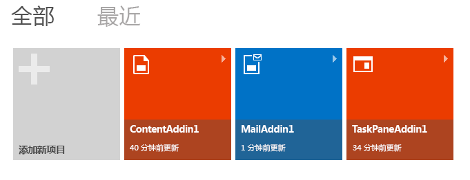
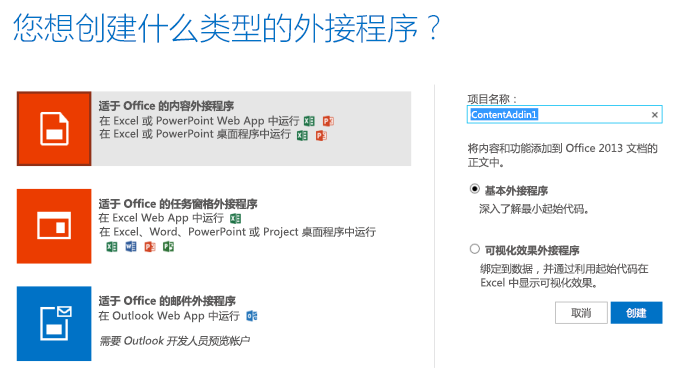

# 使用 Napa 创建 Office 外接程序

[Office 外接程序](../../docs/overview/office-add-ins.md)是一个 Web 应用程序，托管在浏览器控件或运行于 Office 应用程序上下文的 iframe 中。外接程序可以访问当前文档或邮件项目中的数据，还可以连接到 Web 服务以及其他基于 Web 的资源。若要开发外接程序，可以使用基于 Web 标准的技术，例如 HTML5、JavaScript、CSS3、XML 和 REST API。外接程序实际上并没有安装在运行 Office 主机应用程序的计算机上；其实现托管在 Web 服务器上，因此，您可以轻松地从该服务器对它进行维护和更新。

您可以使用 Napa 创建一个简单的 Office 外接程序。

为此，需要执行以下操作：

- 一个 [Microsoft 帐户](http://www.microsoft.com/en-us/account/default.aspx)(microsoft-帐户)
    
- 适用于 [Napa](https://www.napacloudapp.com/ ) Web 应用的URL
    

## 创建一个基本的外接程序

1. 在浏览器中打开 [Napa](https://www.napacloudapp.com/ )。
    
2. 选择“**添加新项目**”磁贴。
    
     **注意：**仅在创建了其他项目时才显示“**添加新项目**”磁贴。 如果这是你的第一个项目，请跳至下一步骤。
    
    

3. 选择你要创建的外接程序类型，对项目命名，然后选择“**创建**”按钮。
    
    

    代码编辑器打开并显示默认网页，该网页已包含一些无需执行任何其他操作便可运行的示例代码。
    
4. 在页面的一侧，选择“运行”按钮（）。
    
    打开与所选外接程序类型相关的 Office 应用程序，显示示例外接程序。 现在可以尝试使用外接程序的功能。
    

## 其他资源

- [Office 外接程序概述](../../docs/overview/office-add-ins.md)
    
- [提供有关 Office 开发人员平台的反馈](http://officespdev.uservoice.com/)
    
- [在 Office 加载项论坛中发布问题](http://social.msdn.microsoft.com/Forums/officeapps/en-US/home?forum=appsforoffice%2Cofficestore&amp;filter=alltypes&amp;sort=lastpostdesc)
    
