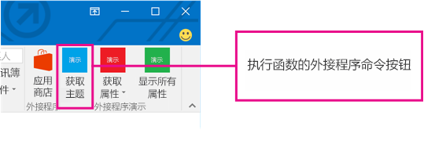
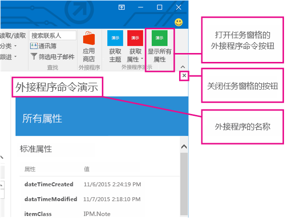
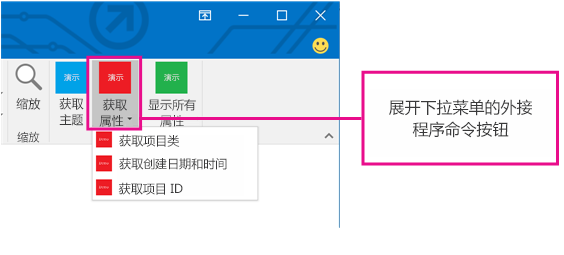

# 用于 Outlook 的外接程序命令

Outlook 外接程序命令提供多种方法，通过添加按钮或下拉菜单从功能区启动特定外接程序操作。这使用户可以使用简单直观且不引人注目的方式访问外接程序。因为它们通过无缝的方式提供增强功能，因此您可以使用外接程序命令创建更具吸引力的解决方案。

> **注意**：外接程序命令仅在适用于 Windows 的 Outlook 2016 和 Outlook 2013 中可用。支持外接程序命令需要使用 [2016 年 3 月 8 日安全更新](https://support.microsoft.com/en-us/kb/3114829)。

外接程序命令仅适用于不使用 [temHasAttachment、ItemHasKnownEntity 或 ItemHasRegularExpressionMatch 规则](manifests/activation-rules.md)限制其激活的项目类型的上下文外接程序。但是，上下文外接程序可以显示不同的命令，具体取决于当前选定的项目是邮件还是约会，并且可以选择是在阅读还是撰写方案中出现。如可能，使用外接程序命令将是[最佳做法](../../docs/overview/add-in-development-best-practices.md)。

## 创建外接程序命令

外接程序命令在  **VersionOverrides** 元素中的外接程序清单中声明。该元素是对清单架构 v1.1 的额外添加，用以确保向后兼容性。在不支持 **VersionOverrides** 的环境中，现有的外接程序会照常像没有外接程序命令一样正常运行。

**VersionOverrides** 清单条目会为外接程序指定很多内容，如主机、要添加到功能区的控件的类型、文本、图标以及任何相关联的功能。有关详细信息，请参阅[在 Outlook 外接程序清单中定义外接程序命令](../outlook/manifests/define-add-in-commands.md)。 

当外接程序需要提供状态更新（例如进度指示器或错误消息）时，它必须通过 [通知 API](../../reference/outlook/NotificationMessages.md) 来执行此操作。此外，必须在清单的 **FunctionFile** 节点中指定的单独 HTML 文件中定义对通知的处理。

开发人员应定义适用于所有所需大小的图标，以便外接程序命令顺利地调整功能区。图标大小有 80 x 80 像素、32 x 32 像素和 16 x 16 像素。

## 外接程序命令的显示方式

外接程序命令在功能区上以按钮形式显示。当用户安装外接程序时，其命令在 UI 中以一组使用外接程序名称标记的按钮显示。这既可以在功能区的默认选项卡，也可以在自定义选项卡上。对于邮件，默认是“**主页**”或“**邮件**”选项卡。对于日历，默认是“**会议**”、“**会议事件**”、“**会议系列**”或“**约会**”选项卡。对于模块扩展，默认是一个自定义选项卡。在默认选项卡，每个外接程序可以包含一个命令数目最多为 6 个的功能区组。在自定义选项卡上，外接程序最多可有 10 组，每组有 6 个命令。外接程序仅限于一个自定义选项卡。

当功能区变得拥挤时，外接程序命令将按顺序调整（折叠）。在所有情况下，用于外接程序的外接程序命令将组合在一起。

将外接程序命令添加到外接程序中后，除非该外接程序还包含[自定义窗格 Outlook 外接程序](../outlook/custom-pane-outlook-add-ins.md)，否则将从应用程序栏中删除外接程序名称。只保留功能区上的外接程序命令按钮。

## 外接程序命令存在哪些 UX 形状？

外接程序命令的 UX 形状由主机应用程序中的一个功能区选项卡组成，其中包含可执行各种功能的按钮。当前支持三种 UI 形状：

- 一个可执行 JavaScript 函数的按钮
        
- 显示另外两种类型的一个或多个按钮的下拉菜单的按钮

此外，上下文加载项还支持： 
- 一个启动任务窗格的按钮

### 执行 JavaScript 函数

使用执行 JavaScript 函数的外接程序命令按钮用于用户无需进行任何其他选择就可以启动操作的方案。这可能适用于诸如跟踪、提醒我或打印，或在用户希望从某个服务获取详细信息之类的情况下使用的一些操作。 

在模块扩展中，外接程序命令按钮可以执行与主要用户界面的内容交互的 JavaScript 函数。

### 启动任务窗格

使用外接程序命令按钮启动适用于用户需要与外接程序进行较长时间交互的方案的任务窗格。例如，外接程序要求更改设置或填写多个字段。 

垂直任务窗格的默认宽度为 300 像素。在 Outlook 资源管理器和检查器中，可以调整垂直任务窗格的大小。 可按照调整待办事项窗格和列表视图大小的方式来调整窗格的大小。

上面的屏幕截图显示垂直任务窗格的示例。窗格将打开，外接程序命令的名称显示在左上角。用户可以在使用完之后使用窗格右上角的 **X** 按钮来关闭外接程序。此窗格不会保留在邮件中。除了外接程序名称和关闭按钮之外，所有显示在任务窗格中的 UI 元素都由外接程序提供。

如果用户选择另一个可打开任务窗格的外接程序命令，任务窗格将被替换为最近使用过的命令。当任务窗格处于打开状态时，如果用户选择执行函数的外接程序命令按钮或选择下拉菜单，会完成操作且任务窗格仍将保持为打开状态。

### 下拉菜单

下拉菜单外接程序命令定义按钮静态列表。菜单中的按钮可为执行函数或打开任务窗格的按钮的组合。不支持子菜单。

## 外接程序命令显示在 UI 中的什么位置？

以下四种方案支持外接程序命令：

### 阅读邮件

用户在阅读邮件时，如果在阅读窗格中查看邮件，添加到默认选项卡的外接程序命令将出现在“**主页**”选项卡上，如果在弹出式阅读窗体中查看，则出现在“**邮件**”选项卡中。

### 撰写邮件

用户在撰写邮件时，添加到默认选项卡的外接程序命令将出现在“**邮件**”选项卡上。

### 以组织者的身份创建或查看约会或会议

当在弹出式窗体中以组织者身份创建、查看约会或会议时，添加到默认选项卡的外接程序命令将出现在“**会议**”、“**会议事件**”、“**会议系列**”或“**约会**”选项卡上。但是，如果用户在日历中选择一项，但不打开弹出窗体，则外接程序的功能区组将在功能区中不可见。

### 以参与者的身份查看会议

当在弹出式窗体中以参与者的身份查看会议时，添加到默认选项卡的外接程序命令将出现在“**会议**”、“**会议事件**”或“**会议系列**”选项卡上。但是，如果用户在日历中选择一项，但不打开弹出窗体，则外接程序的功能区组将在功能区中不可见

### 使用模块扩展

使用模块扩展时，外接程序命令将出现在扩展的自定义选项卡上。

## 其他资源

- [在 Outlook 外接程序清单中定义外接程序命令](../outlook/manifests/define-add-in-commands.md)
    
- [外接程序命令演示 Outlook 外接程序](https://github.com/jasonjoh/command-demo)
    
