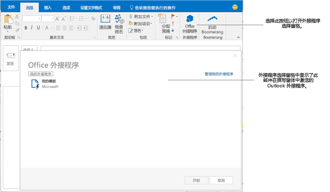

# 创建适用于撰写窗体的 Outlook 外接程序

从 Office 外接程序清单的版本 1.1 的架构和 office.js v1.1 开始，可以创建撰写外接程序（即在撰写窗体中激活的 Outlook 外接程序）。与阅读外接程序（用户查看邮件或约会时在阅读模式中激活的 Outlook 外接程序）相反，撰写外接程序在以下用户方案中可用：

- 在撰写窗体中撰写新的邮件、会议请求或约会。
    
- 查看或编辑现有约会或用户是组织者的会议项目。
    
     >**注意**  如果用户在 Outlook 2013 和 Exchange 2013 的 RTM 版本上，并查看由用户组织的会议项目，则用户可以发现读取外接程序是可用的。 从 Office 2013 SP1 版本开始进行了更改，在同一方案中，只有撰写外接程序能够激活并可用。
- 在单独的撰写表单中撰写内嵌响应邮件或答复邮件。
    
- 编辑会议请求或会议项目答复（“**接受**”、“**暂定**”或“**拒绝**”）。
    
- 建议新的会议项目时间。
    
- 转发或答复会议请求或会议项目。
    
在每个撰写方案中，显示由外接程序定义的任何外接程序命令按钮。 对于未执行外接程序命令的较旧外接程序，用户可以选择功能区中的“**Office 外接程序**”打开外接程序选择窗格，然后选择并启动撰写外接程序。 下图显示了撰写窗体中的外接程序命令。

下图显示了外接程序选择窗格，该窗格由两个不实施外接程序命令的撰写外接程序组成，当用户在 Outlook 中撰写内嵌答复时将激活这两个撰写外接程序。

## 撰写模式下可用的外接程序的类型

撰写外接程序作为 [用于 Outlook 的外接程序命令](../outlook/add-in-commands-for-outlook.md)实施。

## 撰写加载项可用的 API 功能

- 要激活撰写窗体中的加载项，请参阅[在清单中指定激活规则](../outlook/manifests/activation-rules.md#specify-activation-rules-in-a-manifest)中的表 1。
    
- [在 Outlook 的撰写窗体中添加和删除项目附件](../outlook/add-and-remove-attachments-to-an-item-in-a-compose-form.md)
    
- [在 Outlook 的撰写窗体中获取和设置项目数据](../outlook/get-and-set-item-data-in-a-compose-form.md)
    
- [在 Outlook 中撰写约会或邮件时获取、设置或添加收件人](../outlook/get-set-or-add-recipients.md)
    
- [在 Outlook 中撰写约会或邮件时获取或设置主题](../outlook/get-or-set-the-subject.md)
    
- [在 Outlook 中撰写约会或邮件时将数据插入到正文中](../outlook/insert-data-in-the-body.md)
    
- [在 Outlook 中撰写约会时获取或设置位置](../outlook/get-or-set-the-location-of-an-appointment.md)
    
- [在 Outlook 中撰写约会时获取或设置时间](../outlook/get-or-set-the-time-of-an-appointment.md)
    
- [Outlook-Power-Hour_Code-Samples](https://github.com/OfficeDev/Outlook-Power-Hour-Code-Samples)：`ComposeAppDemo`
    

## 其他资源

- [适用于 Office 365 的 Outlook 外接程序入门](https://dev.outlook.com/MailAppsGettingStarted/GetStarted)
    
- [Outlook 外接程序](../outlook/outlook-add-ins.md)
    
