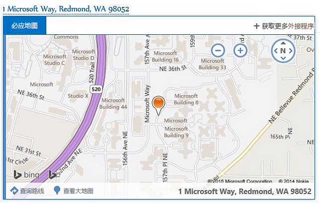

# <a name="contextual-outlook-add-ins"></a>上下文 Outlook 外接程序

上下文加载项是一些根据邮件或约会中的文本进行激活的 Outlook 外接程序。通过使用上下文加载项，用户无需离开邮件本身即可启动与邮件相关的任务，这会带来更便捷、更丰富的用户体验。

上下文加载项不同于那些包括附件或特定于某些邮件类型的加载项。以下是上下文加载项的示例：


- 选择地址以打开位置地图。
    
- 选择会打开会议建议加载项的字符串。
    
- 选择要添加到您的联系人的电话号码。
    
当前，上下文外接程序仅限用于 Outlook Web App。

>**注意：**上下文外接程序不支持外接程序命令。

## <a name="how-to-make-a-contextual-add-in"></a>如何制作上下文外接程序

若要制作上下文外接程序，其外接程序清单必须指定可对其进行激活的实体或正则表达式。实体可以是 [Entities](../../reference/outlook/simple-types.md) 对象中的任何属性。因此，外接程序清单必须包含 **ItemHasKnownEntity** 或 **ItemHasRegularExpressionMatch** 类型的规则。下面的示例演示如何指定作为电话号码的实体：


```XML
<Rule xsi:type="ItemHasKnownEntity" EntityType="PhoneNumber"/>

```

将上下文加载项与帐户关联后，当用户单击突出显示的实体或正则表达式时，会自动启动该上下文加载项。有关 Outlook 外接程序的正则表达式的详细信息，请参阅[使用正则表达式激活规则显示 Outlook 外接程序](../outlook/use-regular-expressions-to-show-an-outlook-add-in.md)。

对上下文加载项有如下一些限制：


- 上下文加载项可以仅存在于阅读加载项中（而不是撰写加载项中）。
    
- 不能指定突出显示的实体颜色。
    
- 未突出显示的实体不会启动卡片中的上下文加载项。
    
- 卡片尺寸的高度是 140-450 像素（建议限制在 300 像素），宽度是 570 像素。
    
- 不能指定该加载项是在该卡片中显示，还是在加载项栏中显示。
    

## <a name="how-to-launch-a-contextual-add-in"></a>如何启动上下文加载项

用户可以通过文本（可以是已知实体，也可以是开发人员的正则表达式）或加载项栏来启动上下文加载项。通常情况下，用户通过观察突出显示的实体即可辨识出上下文加载项。以下示例显示了在邮件中突出显示的样子。此处的实体（地址）显示为蓝色并带有蓝色下划虚线。用户通过单击突出显示的实体即可启动上下文加载项。 


**含有突出显示实体（地址）的文本示例**


虽然突出显示是辨识上下文加载项的最佳指示，但在以下情况下上下文加载项会显示在加载项栏中：

- 当实体是 URL 或电子邮件地址时
    
- 当加载项清单中含有 type="ItemHasRegularExpressionMatch" 和 PropertyName="BodyAsHTML" 或 PropertyName="SenderSMTPAddress" 的规则时
    
- 当加载项清单包含一个使用 OR RuleCollection 的激活规则，其中第一条规则含有 type="ItemIs" 以及 itemType="Appointment" 或 "Message"，且第二条规则含有 type="ItemHasKnownEntity" 或 "ItemHasRegularExpressionMatch"
    
- 如果电子邮件正文的复杂性影响邮件客户端时
    
当邮件中含有多个实体或上下文加载项时，用户交互规则如下所示：


- 如果有多个实体，用户必须单击不同的实体才能启动对应的加载项。
    
- 如果某个实体激活多个加载项，每个加载项将打开一个新选项卡。与加载项栏类似，用户可在选项卡之间进行切换，以更改加载项。例如，名称和地址可能会触发手机加载项和地图。
    
- 如果单个字符串中包含激活多个加载项的多个实体，则整个字符串将突出显示，单击字符串可在单独的选项卡上显示与此字符串相关的所有加载项。例如，表达建议在餐厅集会的字符串将激活"建议的会议"加载项和餐厅评级加载项。
    

## <a name="how-a-contextual-add-in-displays"></a>上下文加载项的显示方式

已激活的上下文加载项将显示在两个位置之一：


- 在卡片中，则是在一个靠近实体的单独窗口中
    
- 在加载项栏中，则是在发件人和邮件正文之间的线上
    
卡片正常情况下将显示在实体下，并尽可能根据该实体进行居中显示。如果实体下方没有足够的空间，则该卡片位于其上方。以下屏幕截图显示突出显示的实体及其下方卡片中的已激活加载项（必应地图）。


**显示在卡片中的外接程序示例**



请注意以下事项：

- "必应地图"选项卡将显示为带蓝色背景的白色文本。如果选择了一个新的加载项，则选项卡将更改为带白色背景的蓝色文本。
    
- 其他加载项选项卡（如果有的话）会以带有白色背景的蓝色文本形式，出现在"必应地图"右侧的一个选项卡中。当用户单击任何选项卡时，该选项卡将更改为带有蓝色背景的白色文本，同时会加载新的加载项。
    
- 单击"+ 获取更多加载项"按钮将打开 Office 应用商店。
    
- 如果加载项名称过长，超出可用空间，将被替换为“...”，放置在“+ 获取更多加载项”的左侧。用户可单击它以查看不适宜放在加载项栏中的加载项下拉列表。
    
- 若要关闭卡片并结束该加载项，用户可单击该卡片外的任意位置。
    
下面的屏幕截图显示，在文本无法突出显示的情况下（例如，该文本包含在超链接中），如何在栏中显示同样的加载项（在本例中是"必应地图")。


**外接程序栏和在 iframe 中的外接程序的示例**


请注意以下事项：

- 在此屏幕截图中，加载项栏将已启动的加载项名称和"+ 获取更多加载项"显示在 iframe 上方。如果存在从加载项栏启动的任何其他加载项（无论是否是上下文加载项），也将会显示出来。
    
- Iframe 也会显示加载项。开发人员可以设置 iframe 的高度，但宽度是固定值。对于卡片，则同样的高度也将用于加载项栏的加载项；开发人员不需要单独指定两种高度。
    

## <a name="how-contextual-add-ins-appear-on-different-devices"></a>上下文加载项在不同设备上的显示方式

在台式电脑上，上下文加载项通常显示在卡片中，如果有多个加载项，它们将显示在不同的选项卡上。在平板电脑上，则同样的加载项将显示在次页，并且如果有多个加载项，它们将显示在选项卡中。在手机上，则加载项将显示为一种沉浸式体验。如果实体上含有多个已激活的加载项，右上角会显示“...”，允许用户在特定实体的不同加载项之间进行导航。


## <a name="current-contextual-add-ins"></a>现用上下文加载项

默认情况下，会为使用 Outlook 外接程序的用户安装以下上下文加载项：


- 必应地图 
    
- 建议的会议
    
另外，Office 应用商店也会提供 [Package Tracker](https://store.office.com/package-tracker-WA104162083.aspx?assetid=WA104162083.aspx) 上下文加载项。


## <a name="additional-resources"></a>其他资源


- [适用于 Office 365 的 Outlook 外接程序入门](https://dev.outlook.com/MailAppsGettingStarted/GetStarted.aspx)
    
- [使用正则表达式激活规则显示 Outlook 外接程序](../outlook/use-regular-expressions-to-show-an-outlook-add-in.md)

- [Entities 对象](../../reference/outlook/simple-types.md)
    
