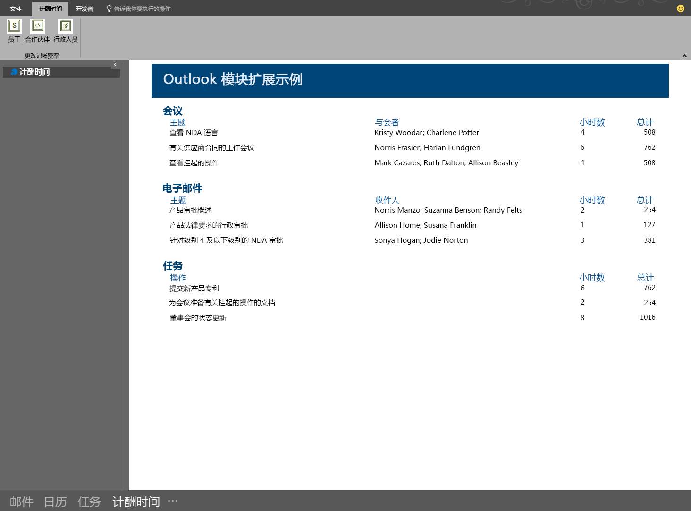

# 模块扩展 Outlook 外接程序

模块扩展外接程序显示在 Outlook 导航栏中，与邮件、任务和日历一起。 模块扩展不限于使用邮件和约会信息，你可以创建在 Outlook 中运行的应用程序，以便使你的用户无需退出 Outlook 即可轻松地访问业务信息和工作效率工具。

> **注意**：模块扩展仅适用于 Office 2016。

要打开模块扩展，用户单击 Outlook 导航栏中的模块的名称或图标即可。 如果用户选择了紧凑型导航，导航栏有一个显示已加载扩展的图标。

如果用户不使用紧凑型导航，导航栏会有两种外观；在加载一个扩展后，导航栏会显示外接程序的名称。

在加载多个外接程序时，会显示“外接程序”一词。单击其中任何一个即可打开扩展的用户界面。

在单击扩展时，Outlook 会将内置模块替换为自定义模块，以便你的用户可以与该外接程序进行交互。 你可以使用外接程序中 Outlook JavaScript API 的所有功能，可以在与外接程序内容交互的 Outlook 功能区中创建命令按钮。 此示例外接程序集成在 Outlook 导航栏中，并拥有将更新外接程序内容的功能区命令。

下面是定义模块扩展的清单文件部分。

    <!-- Add Outlook module extension point -->
    <VersionOverrides xmlns="http://schemas.microsoft.com/office/mailappversionoverrides"
                      xsi:type="VersionOverridesV1_0">
       <VersionOverrides xmlns="http://schemas.microsoft.com/office/mailappversionoverrides/1.1"
                         xsi:type="VersionOverridesV1_1">

         <!-- Begin override of existing elements -->
         <Description resid="residVersionOverrideDesc" />
    
         <Requirements>
           <bt:Sets DefaultMinVersion="1.3">
              <bt:Set Name="Mailbox" />
            </bt:Sets>
          </Requirements>
          <!-- End override of existing elements -->

          <Hosts>
            <Host xsi:type="MailHost">
              <DesktopFormFactor>
                <!-- Set the URL of the file that contains the
                     JavaScript function that controls the extension -->
                <FunctionFile resid="residFunctionFileUrl" />
    
                <!--New Extension Point - Module for a ModuleApp -->
                <ExtensionPoint xsi:type="Module">
                  <SourceLocation resid="residExtensionPointUrl" />
                  <Label resid="residExtensionPointLabel" />
    
                  <CommandSurface>
                    <CustomTab id="idTab">
                      <Group id="idGroup">
                        <Label resid="residGroupLabel" />
    
                        <Control xsi:type="Button" id="group.changeToAssociate">
                          <Label resid="residChangeToAssociateLabel" />
                          <Supertip>
                            <Title resid="residChangeToAssociateLabel" />
                            <Description resid="residChangeToAssociateDesc" />
                          </Supertip>
                          <Icon>
                            <bt:Image size="16" resid="residAssociateIcon16" />
                            <bt:Image size="32" resid="residAssociateIcon32" />
                            <bt:Image size="80" resid="residAssociateIcon80" />
                          </Icon>
                          <Action xsi:type="ExecuteFunction">
                            <FunctionName>changeToAssociateRate</FunctionName>
                          </Action>
                        </Control>
                        
                    </Group>
                      <Label resid="residCustomTabLabel" />
                    </CustomTab>
                  </CommandSurface>
                </ExtensionPoint>
              </DesktopFormFactor>
            </Host>
          </Hosts>
    
          <Resources>
            <bt:Images>
              <bt:Image id="residAddinIcon16" 
                        DefaultValue="https://localhost:8080/Executive-16.png" />
              <bt:Image id="residAddinIcon32" 
                        DefaultValue="https://localhost:8080/Executive-32.png" />
              <bt:Image id="residAddinIcon80" 
                        DefaultValue="https://localhost:8080/Executive-80.png" />
            
              <bt:Image id="residAssociateIcon16" 
                        DefaultValue="https://localhost:8080/Associate-16.png" />
              <bt:Image id="residAssociateIcon32" 
                        DefaultValue="https://localhost:8080/Associate-32.png" />
              <bt:Image id="residAssociateIcon80" 
                        DefaultValue="https://localhost:8080/Associate-80.png" />
            </bt:Images>
    
            <bt:Urls>
              <bt:Url id="residFunctionFileUrl" 
                      DefaultValue="https://localhost:8080/" />
              <bt:Url id="residExtensionPointUrl" 
                      DefaultValue="https://localhost:8080/" />
            </bt:Urls>
    
            <!--Short strings must be less than 30 characters long -->
            <bt:ShortStrings>
              <bt:String id="residExtensionPointLabel" 
                         DefaultValue="Billable Hours" />
              <bt:String id="residGroupLabel" 
                         DefaultValue="Change billing rate" />
              <bt:String id="residCustomTabLabel" 
                         DefaultValue="Billable hours" />
    
              <bt:String id="residChangeToAssociateLabel" 
                         DefaultValue="Associate" />
            </bt:ShortStrings>
    
            <bt:LongStrings>
              <bt:String id="residVersionOverrideDesc" 
                         DefaultValue="Version override description" />
    
              <bt:String id="residChangeToAssociateDesc" 
                         DefaultValue="Change to the associate billing rate: $127/hr" />
            </bt:LongStrings>
          </Resources>
        </VersionOverrides>
      </VersionOverrides>

## 其他资源

* [Outlook 外接程序清单](manifests/manifests.md)
* [在 Outlook 外接程序清单中定义外接程序命令](manifests/define-add-in-commands.md)
* [Outlook 模块扩展计酬时间示例](https://github.com/OfficeDev/Outlook-Add-in-JavaScript-ModuleExtension)
