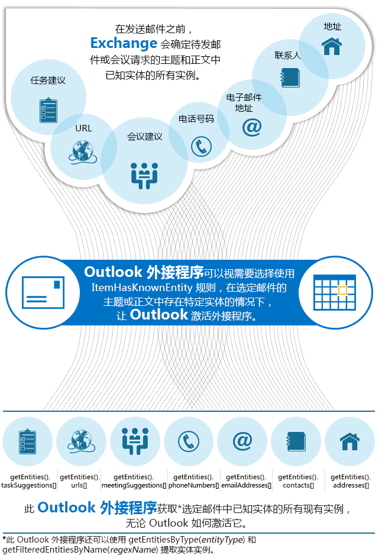

# <a name="match-strings-in-an-outlook-item-as-well-known-entities"></a>将 Outlook 项目中的字符串作为已知实体进行匹配


发送邮件或会议请求项之前，Exchange Server 将分析项目的内容、标识和标记类似于 Exchange 已知实体的主题和正文中的特定字符串，例如，电子邮件地址、电话号码和 URL。邮件和会议请求通过标有已知实体的 Outlook 收件箱中的 Exchange Server 传递。 

使用适用于 Office 的 JavaScript API，您可以获取与特定已知实体匹配的字符串以进行进一步处理。还可以在外接程序清单中的某个规则中指定已知实体，以便当用户查看某个包含该实体匹配项的项目时，Outlook 可以激活外接程序。然后您可以提取实体匹配项并对其执行操作。 

能够方便地从选定的邮件或约会中标识或提取这些实例。例如，您可以将反向电话查找服务构建为 Outlook 外接程序，该外接程序会提取项目主题或正文中类似于电话号码的字符串，进行反向查找，并显示每个电话号码的注册所有者。

本主题将介绍这些已知实体，显示基于已知实体的激活规则示例，以及如何独立使用激活规则中的实体提取实体匹配项。


## <a name="support-for-well-known-entities"></a>支持已知实体


在发件人发送项目之后和 Exchange 将项目传递给收件人之前，Exchange Server 将标记邮件或会议请求项目中的已知实体。因此，只标记在 Exchange 中传输的项目，用户查看此类项目时，Outlook 可以根据这些标记激活外接程序。反之，用户撰写项目或查看“已发送邮件”文件夹中的项目时，由于项目还没有进行传输，Outlook 无法根据已知实体激活外接程序。 

同样，无法提取正在撰写的项目中和“已发送邮件”文件夹中的已知实体，因为这些项目尚未进行传输和标记。有关支持激活的项目类型的其他信息，请参阅 [Outlook 外接程序的激活规则](../outlook/manifests/activation-rules.md#activation-rules-for-outlook-add-ins)。

下表列出 Exchange Server 和 Outlook 支持和识别的实体（因而称作"已知实体"）和每个实体实例的对象类型。将字符串作为某一实体的自然语言识别基于某学习模型，该模型根据大量数据进行训练。因此，该识别具有不确定性。请参阅 [使用已知实体的提示](#tips-for-using-well-known-entities)来了解有关识别条件的详细信息。

 **表 1.受支持的实体及其类型**


|**实体类型**|**识别条件**|**对象类型**|
|:-----|:-----|:-----|
|**地址**|美国街道地址；例如：1234 Main Street, Redmond, WA 07722。通常，对于要识别的地址，它应遵循美国邮政地址的结构，包含街道编号、街道名称、城市、州和邮政编码等大部分元素。地址可写在一行或多行中。|JavaScript **String** 对象|
|**Contact**|对于在自然语言中识别的个人信息的引用。联系人的识别取决于上下文。例如，邮件末尾的签名或在以下信息附近出现的人员姓名：电话号码、地址、电子邮件地址和 URL。|[Contact](../../reference/outlook/simple-types.md) 对象|
|**EmailAddress**|SMTP 电子邮件地址。|JavaScript **String** 对象|
|**MeetingSuggestion**|对事件或会议的引用。例如，Exchange 2013 会将以下文本识别为会面建议： _我们明天一起吃午饭吧。_|[MeetingSuggestion](../../reference/outlook/simple-types.md) 对象|
|**PhoneNumber**|美国电话号码；例如：_(235) 555-0110_|[PhoneNumber](../../reference/outlook/simple-types.md) 对象|
|**TaskSuggestion**|电子邮件中的可操作语句。例如：_请更新电子表格。_|[TaskSuggestion](../../reference/outlook/simple-types.md) 对象|
|**Url**|明确指定了 Web 资源的网络位置和标识符的 Web 地址。Exchange Server 不需要 Web 地址中的访问协议，也不会将链接文本中嵌入的 URL 识别为  **Url** 实体的实例。Exchange Server 可以匹配以下示例： _www.youtube.com/user/officevideos_ _http://www.youtube.com/user/officevideos_|JavaScript  **String** 对象|
图 1 说明了 Exchange Server 和 Outlook 如何支持外接程序的已知实体，以及哪些外接程序可以使用已知实体。请参阅" [在外接程序中检索实体](#retrieving-entities-in-your-add-in)"和" [根据实体的存在情况激活外接程序](#activating-an-add-in-based-on-the-existence-of-an-entity)"了解有关如何使用这些实体的详细信息。


**图 1.Exchange Server、Outlook 和外接程序如何支持已知实体**




## <a name="permissions-to-extract-entities"></a>提取实体的权限


若要提取 JavaScript 代码中的实体，或根据特定已知实体的存在情况激活外接程序，请确保已在外接程序清单中请求了相应的权限。

指定默认的受限权限允许外接程序提取  **Address**、 **MeetingSuggestion** 或 **TaskSuggestion** 实体。若要提取其他任何实体，请指定读取项、读取/写入项目或读取/写入邮箱权限。为此，在清单中使用 [Permissions](http://msdn.microsoft.com/en-us/library/c20cdf29-74b0-564c-e178-b75d148b36d1%28Office.15%29.aspx) 元素指定相应的权限： **Restricted**、 **ReadItem**、 **ReadWriteItem** 或 **ReadWriteMailbox**，如以下示例中所示：


```XML
<Permissions>ReadItem</Permissions>
```


## <a name="retrieving-entities-in-your-add-in"></a>在外接程序中检索实体


只要用户查看的项目主题和正文包含 Exchange 和 Outlook 可识别为已知实体的字符串，这些实例都可用于外接程序。即使外接程序不是基于已知实体激活，也可使用这些实体。具有了相应的权限，就可以使用  **getEntities** 或 **getEntitiesByType** 方法检索在当前邮件或约会中出现的已知实体。 **getEntities** 方法返回包含该项中所有已知实体的 [Entities](../../reference/outlook/simple-types.md) 对象的数组。如果您对特定类型的实体感兴趣，请使用仅返回您想要实体的数组的 **getEntitiesByType** 方法。 [EntityType](../../reference/outlook/Office.MailboxEnums.md) 枚举表示您可以提取的所有已知实体类型。

在调用  **getEntities** 后，可以使用 **Entities** 对象的相应属性获取某一类实体的实例数组。根据实体的类型，数组中的实例可以只是字符串，也可以映射到特定对象。例如图 1 中的示例，若要获取该项目中的地址，请访问由 `getEntities().addresses[]` 返回的数组。 **Entities.addresses** 属性返回 Outlook 识别为邮政地址的字符串数组，同样， **Entities.contacts** 属性返回 Outlook 识别为联系人信息的 **Contact** 对象的数组。表 1 列出了每个受支持实体的实例的对象类型。

以下示例显示如何检索在邮件中发现的任何地址。


```
// Get the address entities from the item.
var entities = Office.context.mailbox.item.getEntities();
// Check to make sure that address entities are present.
if (null != entities &amp;&amp; null != entities.addresses &amp;&amp; undefined != entities.addresses) {
   //Addresses are present, so use them here.
}

```


## <a name="activating-an-add-in-based-on-the-existence-of-an-entity"></a>根据实体的存在情况激活外接程序


使用已知实体的另一种方法是，根据当前查看的项目的主题或正文的一个或多个类型的实体的存在情况，使 Outlook 激活外接程序。可以通过在外接程序清单中指定  **ItemHasKnownEntity** 规则来实现。 [KnownEntityType](http://msdn.microsoft.com/en-us/library/432d413b-9fcc-eb50-cfea-0ed10a43bd52%28Office.15%29.aspx) 简单类型表示由 **ItemHasKnownEntity** 规则支持的不同类型的已知实体。激活外接程序后，还可以根据需要检索此类实体的实例，如上一节" [在外接程序中检索实体](#retrieving-entities-in-your-add-in)"中所述。 

您可以选择在  **ItemHasKnownEntity** 规则中应用正则表达式，以便进一步筛选实体的实例，并让 Outlook 仅对一部分实体实例激活外接程序。例如，可为邮件中包含以"98"开头的华盛顿州邮政编码的街道地址实体指定筛选器。若要对实体实例应用筛选器，请在 **ItemHasKnownEntity** 类型的 **Rule** 元素中使用 [RegExFilter](http://msdn.microsoft.com/en-us/library/56dfc32e-2b8c-1724-05be-5595baf38aa3%28Office.15%29.aspx) 和 [FilterName](http://msdn.microsoft.com/en-us/library/87e10fd2-eab4-c8aa-bec3-dff92d004d39%28Office.15%29.aspx) 属性。

类似于其他激活规则，您可以指定多个规则，为外接程序形成一个规则集合。以下示例在以下 2 个规则中应用了"AND"操作： **ItemIs** 规则和 **ItemHasKnownEntity** 规则。 只要当前项目为邮件，且 Outlook 识别该项目主题或正文中的地址时，此规则集合就将激活外接程序。


```XML
<Rule xsi:type="RuleCollection" Mode="And">
   <Rule xsi:type="ItemIs" ItemType="Message" />
   <Rule xsi:type="ItemHasKnownEntity" EntityType="Address" />
</Rule>
```

以下示例使用当前项目的  **getEntitiesByType** 将变量 `addresses` 设置为前面规则集合的结果。


```
var addresses = Office.context.mailbox.item.getEntitiesByType(Office.MailboxEnums.EntityType.Address);
```

以下  **ItemHasKnownEntity** 规则示例在当前项目的主题或正文中存在 URL 且该 URL 包含字符串"youtube"时将激活外接程序，而不考虑字符串的大小写。


```XML
<Rule xsi:type="ItemHasKnownEntity" 
    EntityType="Url" 
    RegExFilter="youtube"
    FilterName="youtube"
    IgnoreCase="true"/>
```

以下示例使用当前项目的  **getFilteredEntitiesByName(name)** 设置变量 `videos`，以获取与前面的  **ItemHasKnownEntity** 规则中的正则表达式匹配的结果的数组。


```
var videos = Office.context.mailbox.item.getFilteredEntitiesByName(youtube);
```


## <a name="tips-for-using-well-known-entities"></a>使用已知实体的提示


在外接程序中使用已知实体时，应了解一些事实和限制。只要在用户读取包含已知实体匹配项的项目时激活了外接程序，无论是否使用  **ItemHasKnownEntity** 规则，都适用于以下情况：


1. 仅当字符串为英文形式时，您才可以提取已知实体字符串。
    
2. 您可以从项目正文的前 2,000 个字符中提取已知实体，但不能超过此限制。此大小限制有助于平衡功能和性能之间的需求，因此 Exchange Server 和 Outlook 不会因分析和确定大型邮件和约会中的已知实体实例而停滞。请注意，无论外接程序是否指定  **ItemHasKnownEntity** 规则，此限制都是适用的。如果外接程序使用此类规则，还要注意以下项目 2 中针对 Outlook 富客户端的的规则处理限制。
    
3. 您可以从约会（由邮箱所有者之外的人员组织的会议）中提取实体。如果日历项目不是会议或不是由邮箱所有者组织的会议，则不能从中提取实体。
    
4. 您可以仅从邮件中而非约会中提取  **MeetingSuggestion** 类型的实体。
    
5. 您可以提取项目正文中明确存在的 URL，但无法提取 HTML 项目正文中内嵌在超链接文本中的 URL。考虑改用  **ItemHasRegularExpressionMatch** 规则获取明确和内嵌的 URL。将 **BodyAsHTML** 指定为 _PropertyName_，并将匹配 URL 的正则表达式指定为  _RegExValue_。
    
6. 不能从"已发送邮件"文件夹中的邮件提取实体。
    
此外，如果使用 [ItemHasKnownEntity](http://msdn.microsoft.com/en-us/library/87e10fd2-eab4-c8aa-bec3-dff92d004d39%28Office.15%29.aspx) 规则，并可能影响您希望激活外接程序的方案，则适用于以下情况：


1. 使用  **ItemHasKnownEntity** 规则时，预期 Outlook 仅匹配英文形式的实体字符串，而不考虑清单中指定的默认区域设置。
    
2. 当外接程序在 Outlook 富客户端上运行时，预期 Outlook 将  **ItemHasKnownEntity** 规则应用到项目正文的第一个兆字节中，而不会应用到正文中超过此限制的其余字符串。
    
3. 不能使用  **ItemHasKnownEntity** 规则对"已发送邮件"文件夹中的邮件激活外接程序。
    

## <a name="additional-resources"></a>其他资源


- [创建适用于阅读窗体的 Outlook 外接程序](../outlook/read-scenario.md)
    
- [从 Outlook 项目中提取实体字符串](../outlook/extract-entity-strings-from-an-item.md)
    
- [Outlook 外接程序的激活规则](../outlook/manifests/activation-rules.md)
    
- [使用正则表达式激活规则显示 Outlook 外接程序](../outlook/use-regular-expressions-to-show-an-outlook-add-in.md)
    
- [了解 Outlook 外接程序权限](../outlook/understanding-outlook-add-in-permissions.md)
    
