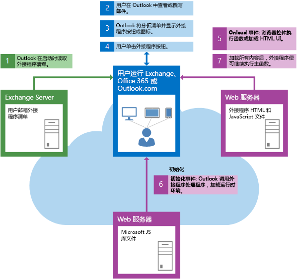

# Outlook 外接程序体系结构和功能概述

Outlook 外接程序包含一个 XML 清单和代码（JavaScript 和 HTML）。清单指定外接程序的名称和说明，以及外接程序如何集成到 Outlook。使用该清单，开发人员可以将按钮置于命令界面上，中断与正则表达式匹配项的链接等等。清单还定义了托管 JavaScript 和 HTML 代码的外接程序的 URL。

当用户或管理员获取外接程序时，外接程序的清单将保存到用户的邮箱或组织中。当 Outlook 启动时，它会加载用户已安装的所有清单，并对其进行处理，还会为外接程序设置所有扩展点（例如，显示命令界面中的按钮，对当前所选的邮件运行正则表达式等）。用户现在可以使用该外接程序。

当用户与外接程序交互时，从清单中指定的主机位置加载 JavaScript 和 HTML 文件。

外接程序可以使用 Office.js API 访问 Outlook 外接程序 API 并与 Outlook 进行交互。

**用户启动 Outlook 时典型组件的交互**

### 版本控制

由于我们在不断改进 Outlook 客户端和外接程序平台的同时还添加集成外接程序的新方法，因此有时无法同时在所有客户端（Mac、Windows、Web、移动）中实现某个功能。为了处理这种情况，我们同时提供了清单和 API 的版本。通过这种方式，该平台会始终支持向后兼容，这意味着开发人员可以构建一个能够以下层方式运行在较旧的客户端中的外接程序，但也允许您在较新的客户端中使用新功能。您可以阅读有关版本控制在 [Outlook 外接程序清单](manifests/manifests.md)中的工作方式的详细信息。

## Outlook 外接程序功能

Outlook 外接程序提供了可用于支持各种方案的许多丰富功能。

|**功能**|**说明**|
|:-----|:-----|
|上下文激活|可以基于以下条件激活 Outlook 上下文外接程序：<ul><li>（默认）对于邮箱或日历中的任何项</li><li>对于特定项目类型（电子邮件、会议请求邮件或约会）</li><li>对于项邮件类</li><li>对于邮件或约会中的特定实体，请参阅 [上下文 Outlook 外接程序](contextual-outlook-add-ins.md)。</li><li>基于特定规则或正则表达式，请参阅 [Outlook 外接程序的激活规则](manifests/activation-rules.md)和 [使用正则表达式激活规则显示 Outlook 外接程序](use-regular-expressions-to-show-an-outlook-add-in.md)</li><li>对于属性的字符串匹配，请参阅[作为众所周知的实体匹配 Outlook 项中的字符串](match-strings-in-an-item-as-well-known-entities.md)</li></ul>|
|模块扩展|Outlook 模块扩展将外接程序与 Outlook 导航栏相集成。有关详细信息，请参阅[将 Outlook 外接程序与 Outlook 导航栏相集成](../outlook/extension-module-outlook-add-ins.md)。仅可在 Outlook 2016 for Windows 中使用模块扩展。|
|外接程序命令|Outlook 外接程序命令提供从功能区启动特定外接程序操作的方法。它们仅适用于那些用于所有电子邮件或事件的模块扩展和外接程序。有关详细信息，请参阅[用于 Outlook 的外接程序命令](../outlook/add-in-commands-for-outlook.md)。 |
|漫游设置|Outlook 外接程序可以保存特定于您可以在后续 Outlook 会话中访问的用户邮箱的数据。有关详细信息，请参阅 [获取和设置 Outlook 外接程序的外接程序元数据](../outlook/metadata-for-an-outlook-add-in.md)。 |
|自定义属性|Outlook 外接程序可以保存特定于您可以在后续 Outlook 会话中访问的用户邮箱中某个项目的数据。有关详细信息，请参阅 [获取和设置 Outlook 外接程序的外接程序元数据](../outlook/metadata-for-an-outlook-add-in.md)。|
|获取附件或整个选定的项|上下文 Outlook 外接程序可以从服务器端访问附件和整个选定的项。请参阅以下内容：<ul><li>附件- 请参阅 [从服务器上获取 Outlook 项目的附件](get-attachments-of-an-outlook-item.md)和 [在 Outlook 的撰写窗体中添加和删除项目附件]add-and-remove-attachments-to-an-item-in-a-compose-form.md)</li><li>整个选定的项目 - 这类似于使用回调标记获取附件。请参阅以下内容：<ul><li>[Office.context.mailbox](../../reference/outlook/Office.context.mailbox.md) 中的 **mailbox.getCallbackTokenAsync** 方法 - 提供回调标记来标识外接程序的适用于 Exchange Server 的服务器端代码。</li><li>[Office.context.mailbox](../../reference/outlook/Office.context.mailbox.item.md) 中的 **item.itemId** 属性 - 标识用户正在读取和服务器端代码正在获取的项。</li><li>
  [Office.context.mailbox](../../reference/outlook/Office.context.mailbox.md) 中的 **mailbox.ewsUrl** 属性 - 提供 EWS 端点 URL、回调标记和项目 ID，而服务器端代码可使用此 URL 访问 [GetItem](http://msdn.microsoft.com/en-us/library/e3590b8b-c2a7-4dad-a014-6360197b68e4(Office.15).aspx) EWS 操作以获取整个项目。</li></ul></li></ul>|
|用户配置文件|邮件外接程序可以访问用户配置文件中的显示名称、电子邮件地址和时区。有关详细信息，请参阅 [UserProfile](../../reference/outlook/Office.context.mailbox.userProfile.md) 对象。|

## 开始构建 Outlook 外接程序

要开始构建 Outlook 外接程序，请参阅[开始使用适用于 Office 365 的 Outlook 外接程序](https://dev.outlook.com/MailAppsGettingStarted/GetStarted)或[将 Outlook 外接程序与 Outlook 导航栏相集成](../outlook/extension-module-outlook-add-ins.md)。

## 其他资源

有关通常适用于开发 Office 外接程序的概念，请参阅以下资源：

- [Office 外接程序的设计准则](../../docs/design/add-in-design.md)

- [开发 Office 外接程序的最佳做法](../../docs/design/add-in-development-best-practices.md)

- 
  [许可 Office 和 SharePoint 外接程序](http://msdn.microsoft.com/library/3e0e8ff6-66d6-44ff-b0c2-59108ebd9181%28Office.15%29.aspx)

- 
  [将 Office 与 SharePoint 外接程序和 Office 365 Web 应用提交到 Office 应用商店](http://msdn.microsoft.com/library/ff075782-1303-4517-91cc-b3d730e9b9ae%28Office.15%29.aspx)

- [适用于 Office 的 JavaScript API](../../reference/javascript-api-for-office.md)

- [Outlook 外接程序清单](../outlook/manifests/manifests.md)

