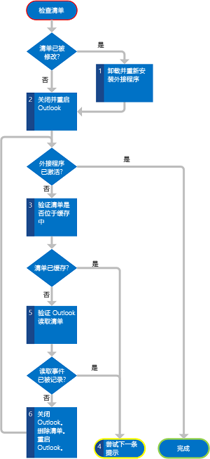

# <a name="troubleshoot-outlook-add-in-activation"></a>排查 Outlook 外接程序激活问题


Outlook 外接程序激活是上下文相关的，并且基于外接程序清单中的激活规则。当前选定项的条件符合外接程序的激活规则时，主机应用程序会激活外接程序按钮并将其显示在 Outlook UI 中（用于撰写外接程序的外接程序选择窗格，用于阅读外接程序的外接程序栏）。但是，如果你的外接程序未按预期激活，则应调查以下方面，确定可能的原因。

<a name="troubleshootingmailapps"></a>
## <a name="is-the-user-mailbox-on-a-version-of-exchange-server-that-is-at-least-exchange-2013?"></a>用户邮箱是否位于至少为 Exchange 2013 的某个版本的 Exchange Server 上？


首先，确保你正在测试的用户电子邮件帐户位于至少为 Exchange 2013 的某个版本的 Exchange Server 上。如果你正在使用在Exchange 2013 之后发布的特定功能，那么请确保用户的帐户使用合适的 Exchange 版本。

你可使用以下方法之一验证 Exchange 2013 的版本：


- 咨询您的 Exchange Server 管理员。
    
- 如果在 Outlook Web App 或适用于设备的 OWA 上测试外接程序，请在脚本调试程序（例如，Internet Explorer 附带的 JScript 调试程序）中查找指定脚本加载位置的 **script** 标签的 **src** 属性。该路径应包含子字符串 **owa/15.0.516.x/owa2/...**，其中 **15.0.516.x** 表示 Exchange Server 的版本，如 **15.0.516.2**。
    
- 或者，可使用 [Office.context.mailbox.diagnostics.hostVersion](../../reference/outlook/Office.context.mailbox.diagnostics.md) 属性来验证版本。在 Outlook Web App 和适用于设备的 OWA 上，此属性会返回 Exchange Server 的版本。
    
- 如果能够在 Outlook 上测试外接程序，则可使用采用 Outlook 对象模型和 Visual Basic 编辑器的以下简单调试技术：
    
      1. 首先，验证已为 Outlook 启用宏。依次选择“**文件**”、“**选项**”、“**信任中心**”、“**信任中心设置**”和“**宏设置**”。确保在信任中心选中“**所有宏通知**”。在 Outlook 启动时，应还选中“**启用宏**”。
    
      2. 在功能区的“**开发人员**”选项卡上，选择“**Visual Basic**”。
    
     >
  **注意**  没看到“**开发人员**”选项卡？请参阅 [操作说明：在功能区显示“开发人员”选项卡](http://msdn.microsoft.com/en-us/library/ce7cb641-44f2-4a40-867e-a7d88f8e98a9%28Office.15%29.aspx) 以将其打开。3.在 Visual Basic 编辑器中，依次选择“**视图**”和“**即时窗口**”。
    
      4. 在即时窗口中键入以下内容以显示 Exchange Server 的版本。返回值的主版本必须等于或大于 15。
    
        - 如果用户的配置文件中只有一个 Exchange 帐户：
        
            
            ?Session.ExchangeMailboxServerVersion
            
        
        - 如果同一用户配置文件中存在多个 Exchange 帐户：
        
            
            ?Session.Accounts.Item(emailAddress).ExchangeMailboxServerVersion
         
        
        - _emailAddress_ 表示一个字符串，其中包含该用户的主 STMP 地址。例如，如果用户的主 SMTP 地址是 randy@contoso.com，键入以下命令：
        
            
            ?Session.Accounts.Item("randy@contoso.com").ExchangeMailboxServerVersion
        


## <a name="is-the-add-in-disabled?"></a>外接程序是否已禁用？


任何 Outlook 富客户端可出于性能原因禁用外接程序，这些原因包括超出 CPU 内核或内存的使用阈值、超出崩溃容忍度以及超出处理外接程序的所有正则表达式的时间。发生这种情况时，Outlook 富客户端会显示一条禁用外接程序的通知。 


 >**注意**  仅 Outlook 富客户端可监控资源使用状况，但在 Outlook 富客户端中禁用某个外接程序会同时在 Outlook Web App 和适用于设备的 OWA 中禁用该外接程序。

使用以下方法之一验证外接程序是否已禁用： 


- 在 Outlook Web App 中，直接登录电子邮件帐户，选择“设置”图标，然后选择“**管理外接程序**”转到 Exchange 管理中心，你可在这里验证外接程序是否已启用。
    
- 在 Outlook 中，转到 Backstage 视图并选择“**管理外接程序**”。登录 Exchange 管理中心验证外接程序是否已启用。
    
- 在 Outlook for Mac 中，在外接程序栏上选择“**管理外接程序**”。登录 Exchange 管理中心验证外接程序是否已启用。
    

## <a name="does-the-tested-item-support-outlook-add-ins?-is-the-selected-item-delivered-by-a-version-of-exchange-server-that-is-at-least-exchange-2013?"></a>已测试项是否支持 Outlook 外接程序？所选项目是否由至少为 Exchange 2013 的某个版本的 Exchange Server 提供？


如果您的 Outlook 外接程序为阅读外接程序并且应该在用户查看邮件（包括电子邮件、会议请求、响应和取消）或约会时激活，尽管这些项目通常支持外接程序，但如果选定项存在以下情形之一，则会出现例外：


- 受信息权限管理 (IRM) 保护。
    
- 使用 S/MIME 格式，或以其他方式加密以提供保护。
    
- 草稿（没有为其分配发件人），或位于 Outlook“草稿”文件夹中。
    
- 在“垃圾邮件”文件夹中。
    
- 具有邮件类别 IPM.Report.* 的送达报告或通知，包括送达和未送达报告 (NDR)，以及已读、未读和延迟通知。
    
- 附加到其他邮件或从文件系统打开的 .msg 文件。
    
此外，由于约会始终以 RTF 格式保存，因此指定 [BodyAsHTML](http://msdn.microsoft.com/en-us/library/bfb726cd-81b0-a8d5-644f-2ca90a5273fc%28Office.15%29.aspx) 的 **PropertyName** 值的 **ItemHasRegularExpressionMatch** 规则不会对以纯文本或 RTF 格式保存的约会或邮件激活外接程序。

即使某邮件项不是以上类型之一，如果该项不是使用至少为 Exchange 2013 的某个版本的 Exchange Server 传递，则不会在该项上确定已知实体和属性（如发件人的 SMTP 地址）。依赖这些实体或属性的任何激活规则将不会得到满足，并且外接程序将不会激活。

如果您的外接程序为撰写外接程序并且应该在用户撰写邮件或会议请求时激活，请确保该项目未受 IRM 保护。


## <a name="is-the-add-in-manifest-installed-properly,-and-does-outlook-have-a-cached-copy?"></a>加载项清单是否安装正确，Outlook 是否有已缓存副本？


此方案仅适用于 Outlook for Windows。正常情况下，为邮箱安装 Outlook 外接程序时，Exchange Server 会将外接程序清单从你指示的位置复制到该 Exchange Server 上的邮箱。每次启动 Outlook 时，它都会将为该邮箱安装的所有清单读取到以下位置的临时缓存中： 

%LocalAppData%\Microsoft\Office\15.0\WEF 

例如，对于用户 John，该缓存可能位于 C:\Users\john\AppData\Local\Microsoft\Office\15.0\WEF。

如果无法对任何项目激活外接程序，则清单可能未正确安装在 Exchange Server 上，或者 Outlook 未在启动时正确读取清单。使用 Exchange 管理中心确保已为您的邮箱安装和启用外接程序，并在必要时重新启动 Exchange Server。

图 1 显示验证 Outlook 是否具有有效版本的清单的步骤摘要。 


**图 1.验证 Outlook 是否已正确缓存清单的步骤的流程图**

以下过程描述详细信息。


1. 如果你已在 Outlook 打开时修改了清单，并且未使用 Napa、Visual Studio 2012 或 Visual Studio 的更高版本开发外接程序，则应卸载外接程序，并使用 Exchange 管理中心重新安装它。 
    
2. 重新启动 Outlook 并测试 Outlook 现在是否已激活加载项。
    
3. 如果 Outlook 无法激活外接程序，则检查 Outlook 是否具有外接程序清单的正确缓存副本。请查看以下路径：
    
    %LocalAppData%\Microsoft\Office\15.0\WEF
    
    可以在以下子文件夹中找到清单：
```
    \<insert your guid>\<insert base 64 hash>\Manifests\<ManifestID>_<ManifestVersion>
```
    
     >**Note**  The following is an example of a path to a manifest installed for a mailbox for the user John:
    
    C:\Users\john\appdata\Local\Microsoft\Office\15.0\WEF\{8D8445A4-80E4-4D6B-B7AC-D4E6AF594E73}\GoRshCWa7vW8+jhKmyiDhA==\Manifests\b3d7d9d5-6f57-437d-9830-94e2aaccef16_1.2
    
    Verify whether the manifest of the add-in you're testing is among the cached manifests.
    
4. 如果该清单在缓存中，请跳过本节的其余部分，并考虑本节后面的其他可能原因。
    
5. 如果清单不在缓存中，请检查 Outlook 是否已确实从 Exchange Server 中成功读取清单。为此，请使用 Windows 事件查看器：
    
      1. 在“**Windows 日志**”下，选择“**应用程序**”。
    
      2. 查找其事件 ID 等于 63（表示 Outlook 从 Exchange Server 下载清单）的近期事件。
    
      3. 如果 Outlook 成功读取了清单，则记录的事件应具有以下说明：
    
         **Exchange Web 服务请求 GetAppManifests 已成功。**
    
        然后跳过本节的其余部分，并考虑本节后面的其他可能原因。
    

    有关在 Windows 7 中打开事件查看器的信息，请参阅 [打开事件查看器](http://windows.microsoft.com/en-US/windows7/Open-Event-Viewer)。
    
6. 如果看不到成功事件，请关闭 Outlook，然后删除以下路径中的所有清单：
```
    %LocalAppData%\Microsoft\Office\15.0\WEF\<insert your guid>\<insert base 64 hash>\Manifests\
```
    Start Outlook and test whether Outlook now activates the add-in.
    
7. 如果 Outlook 无法激活外接程序，请返回步骤 3 再次验证 Outlook 是否已正确读取清单。
    

## <a name="are-you-using-the-appropriate-activation-rules?"></a>使用的激活规则是否合适？


自 Office 外接程序清单架构的版本 1.1 起，你可以创建当用户位于撰写窗体（撰写外接程序）或阅读窗体（阅读外接程序）中时激活的外接程序。确保为外接程序将在其中激活的每种窗体类型指定相应的激活规则。例如，你可以仅使用 [ItemIs](http://msdn.microsoft.com/en-us/library/f7dac4a3-1574-9671-1eda-47f092390669%28Office.15%29.aspx) 规则（**FormType** 属性设置为 **Edit** 或 **ReadOrEdit**）激活撰写外接程序，你无法使用任何其他类型的规则，例如用于撰写外接程序的 [ItemHasKnownEntity](http://msdn.microsoft.com/en-us/library/87e10fd2-eab4-c8aa-bec3-dff92d004d39%28Office.15%29.aspx) 和 [ItemHasRegularExpressionMatch](http://msdn.microsoft.com/en-us/library/bfb726cd-81b0-a8d5-644f-2ca90a5273fc%28Office.15%29.aspx) 规则。有关详细信息，请参阅 [Outlook 外接程序的激活规则](../outlook/manifests/activation-rules.md)。


## <a name="if-you-use-a-regular-expression,-is-it-properly-specified?"></a>如果使用正则表达式，该表达式的指定是否正确？


由于激活规则中的正则表达式是阅读加载项的 XML 清单文件的一部分，因此当正则表达式使用特定字符时，请务必遵守 XML 处理器支持的相应转义序列。表 1 列出了这些特殊字符。 


**表 1.正则表达式的转义序列**


|**字符**|**说明**|**要使用的转义序列**|
|:-----|:-----|:-----|
|"|双引号|&amp;quot;|
|&amp;|与号|&amp;amp;|
|'|撇号|&amp;apos;|
|<|小于号|&amp;lt;|
|>|大于号|&amp;gt;|

## <a name="if-you-use-a-regular-expression,-is-the-read-add-in-activating-in-outlook-web-app-or-owa-for-devices,-but-not-in-any-of-the-outlook-rich-clients?"></a>如果使用正则表达式，阅读加载项是否在 Outlook Web App 或适用于设备的 OWA（而不是个别 Outlook 富客户端）中激活？


Outlook 富客户端使用的正则表达式引擎与 Outlook Web App 和适用于设备的 OWA 使用的不同。Outlook 富客户端使用作为 Visual Studio 标准模板库一部分提供的 C++ 正则表达式引擎。该引擎符合 ECMAScript 5 标准。Outlook Web App 和适用于设备的 OWA 使用属于 JavaScript 一部分的正则表达式评估，由浏览器提供，且支持 ECMAScript 5 超集。 

在大多数情况下，这些主机应用程序查找激活规则中同一正则表达式的相同匹配，但也存在例外。例如，如果正则表达式包含基于预定义的字符类的自定义字符类，则 Outlook 富客户端将返回与 Outlook Web App 和适用于设备的 OWA 不同的结果。举例来说，其中包含速记字符类 `[\d\w]` 的字符类将返回不同的结果。在这种情况下，为避免不同主机上出现不同结果，请改为使用 `(\d|\w)`。

全面测试正则表达式。如果它返回不同的结果，请重新编写该正则表达式，以便同时与两个引擎相兼容。若要验证某个 Outlook 富客户端上的评估结果，请编写一个小 C++ 程序，针对你尝试匹配的文本示例应用该正则表达式。C++ 测试程序在 Visual Studio 上运行，它将使用标准模板库，以便模拟运行同一正则表达式时的 Outlook 富客户端行为。若要验证 Outlook Web App 或适用于设备的 OWA 上的评估结果，请使用你最喜爱的 JavaScript 正则表达式测试程序。


## <a name="if-you-use-an-itemis,-itemhasattachment,-or-itemhasregularexpressionmatch-rule,-have-you-verified-the-related-item-property?"></a>如果使用 ItemIs、ItemHasAttachment 或 ItemHasRegularExpressionMatch 规则，您是否已验证相关项属性？


如果使用 **ItemHasRegularExpressionMatch** 激活规则，请验证 **PropertyName** 属性的值是否为你预期的选定项的值。下面是调试相应属性的一些提示：


- 如果选定项是邮件，并且你在 **PropertyName** 属性中指定 **BodyAsHTML**，请打开该邮件，然后选择“**查看源文件**”验证该项目的 HTML 形式的邮件正文。
    
- 如果选定项是约会，或者激活规则在 **PropertyName** 中指定 **BodyAsPlaintext**，则可使用 Outlook 对象模型和 Outlook for Windows 中的 Visual Basic 编辑器：
    
      1. 确保已启用宏并且在功能区中显示 Outlook 的“**开发人员**”选项卡。如果不确定如何执行此操作，请参阅 [用户邮箱是否位于至少为 Exchange 2013 的某个版本的 Exchange Server 上？](#troubleshootingmailapps) 下的步骤 1 和 2。
    
      2. 在 Visual Basic 编辑器中，依次选择“**视图**”和“**即时窗口**”。
    
      3. 键入以下内容显示与方案对应的各个属性。 
    
      - 在 Outlook 资源管理器中选择的邮件或约会项的 HTML 正文：
    
            
              ?ActiveExplorer.Selection.Item(1).HTMLBody
        


     - 在 Outlook 资源管理器中选择的邮件或约会项的纯文本正文：
    
            
              ?ActiveExplorer.Selection.Item(1).Body
            


      - 在当前的 Outlook 检查器中打开的邮件或约会项的 HTML 正文：
    
            
              ?ActiveInspector.CurrentItem.HTMLBody
        
      - 在当前的 Outlook 检查器中打开的邮件或约会项的纯文本正文：
    
            
              ?ActiveInspector.CurrentItem.Body
            

如果 **ItemHasRegularExpressionMatch** 激活规则指定 **Subject** 或 **SenderSMTPAddress**，或者你使用 **ItemIs** 或 **ItemHasAttachment** 规则，并且你熟悉或想要使用 MAPI，则可使用 [MFCMAPI](http://mfcmapi.codeplex.com/) 来验证表 2 中你的规则所依赖的值。


**表 2.激活规则和相应的 MAPI 属性**


|**规则类型**|**请验证此 MAPI 属性**|
|:-----|:-----|
|使用 **Subject** 的 **ItemHasRegularExpressionMatch** 规则|
  [PidTagSubject](http://msdn.microsoft.com/en-us/library/aa7ba4d9-c5e0-4ce7-a34e-65f675223bc9%28Office.15%29.aspx)|
|使用 **SenderSMTPAddress** 的 **ItemHasRegularExpressionMatch** 规则|
  [PidTagSenderSmtpAddress](http://msdn.microsoft.com/en-us/library/321cde5a-05db-498b-a9b8-cb54c8a14e34%28Office.15%29.aspx) 和 [PidTagSentRepresentingSmtpAddress](http://msdn.microsoft.com/en-us/library/5ed122a2-0967-4de3-a2ee-69f81ae77b16%28Office.15%29.aspx)|
|**ItemIs**|
  [PidTagMessageClass](http://msdn.microsoft.com/en-us/library/1e704023-1992-4b43-857e-0a7da7bc8e87%28Office.15%29.aspx)|
|**ItemHasAttachment**|
  [PidTagHasAttachments](http://msdn.microsoft.com/en-us/library/fd236d74-2868-46a8-bb3d-17f8365931b6%28Office.15%29.aspx)|
验证属性值后，即可使用正则表达式评估工具来测试正则表达式是否在该值中找到匹配项。


## <a name="does-the-host-application-apply-all-the-regular-expressions-to-the-portion-of-the-item-body-as-you-expect?"></a>主机应用程序是否按预期将所有正则表达式应用到项目正文部分？


本节适用于使用正则表达式的所有激活规则，尤其是应用于项目正文的那些规则，这些规则可能较大，需要较长时间才能对匹配项进行评估。你应意识到，即使激活规则所依赖的项目属性具有预期的值，主机应用程序也可能无法评估整个项目属性值的所有正则表达式。为了提供合理的性能和控制阅读加载项的过量资源使用率，Outlook、Outlook Web App 和适用于设备的 OWA 可考虑有关在运行时处理激活规则中的正则表达式的以下限制：


- 评估的项目正文的大小 — 主机应用程序在其中评估正则表达式的项目正文部分存在限制。这些限制取决于主机应用程序、组成要素和项目正文的格式。请参阅[激活限制和适用于 Outlook 外接程序的 JavaScript API](../outlook/limits-for-activation-and-javascript-api-for-outlook-add-ins.md) 中表 2 中的详细信息。
    
- 正则表达式匹配项的数目 — Outlook 富客户端、Outlook Web App 和适用于设备的 OWA 分别返回最多 50 个正则表达式匹配项。这些匹配项是唯一的，依据此限制，重复匹配项不计数。不要假定返回的匹配项的任何顺序，也不要假定 Outlook 富客户端与 Outlook Web App 和适用于设备的 OWA 中的顺序是相同的。如果你希望你的激活规则中存在正则表达式的许多匹配项，而你缺少某个匹配项，则表示你可能超出此限制。
    
- 正则表达式匹配项的长度 — 主机应用程序将返回的正则表达式匹配项的长度存在限制。主机应用程序不包括超出限制的任何匹配项，并且不显示任何警告消息。你可以使用其他正则表达式评估工具或独立的 C++ 测试程序运行你的正则表达式，以验证你是否具有超出此类限制的匹配项。表 3 总结了这些限制。有关详细信息，请参阅[激活限制和适用于 Outlook 外接程序的 JavaScript API](../outlook/limits-for-activation-and-javascript-api-for-outlook-add-ins.md) 中的表 3。
    
    **表 3.正则表达式匹配的长度限制**


|**正则表达式匹配项的长度限制**|**Outlook 富客户端**|**Outlook Web App 或 适用于设备的 OWA**|
|:-----|:-----|:-----|
|项目正文采用纯文本|1.5 KB|3 KB|
|项目正文采用 HTML|3 KB|3 KB|
- 评估阅读加载项的所有正则表达式所花费的时间 - 对于某个 Outlook 富客户端：默认情况下，对于每个阅读加载项，Outlook 必须在 1 秒钟内完成对其激活规则中的所有正则表达式的评估。否则，如果 Outlook 无法完成评估，则 Outlook 最多尝试 3 次并禁用该加载项。Outlook 会在通知栏中显示一条消息，指示该加载项已禁用。正则表达式可用的时间可通过设置组策略或注册表项来进行修改。 
    
     >**注意**  请注意，如果 Outlook 丰富客户端禁用读取外接程序，则读取外接程序在 Outlook 丰富客户端、Outlook Web App 和适用于设备的 OWA 的同一邮箱中不可用。

## <a name="additional-resources"></a>其他资源


- [部署和安装 Outlook 外接程序以进行测试](../outlook/testing-and-tips.md)
    
- [Outlook 外接程序的激活规则](../outlook/manifests/activation-rules.md)
    
- [使用正则表达式激活规则显示 Outlook 外接程序](../outlook/use-regular-expressions-to-show-an-outlook-add-in.md)
    
- [Outlook 外接程序的激活和 JavaScript API 限制](../outlook/limits-for-activation-and-javascript-api-for-outlook-add-ins.md)
    
- [打开事件查看器](http://windows.microsoft.com/en-US/windows7/Open-Event-Viewer)
    
- 
  [ItemHasAttachment complexType](http://msdn.microsoft.com/en-us/library/031db7be-8a25-5185-a9c3-93987e10c6c2%28Office.15%29.aspx)
    
- 
  [ItemHasRegularExpressionMatch complexType](http://msdn.microsoft.com/en-us/library/bfb726cd-81b0-a8d5-644f-2ca90a5273fc%28Office.15%29.aspx)
    
- 
  [ItemIs complexType](http://msdn.microsoft.com/en-us/library/926249ab-2d2f-39f5-1d73-fab1c989966f%28Office.15%29.aspx)
    
- 
  [MailApp complexType](http://msdn.microsoft.com/en-us/library/696b9fcf-cd10-3f20-4d49-86d3690c887a%28Office.15%29.aspx)
    
