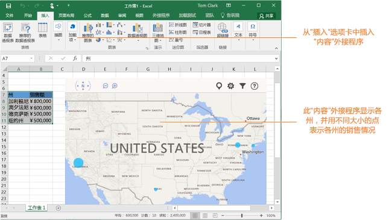
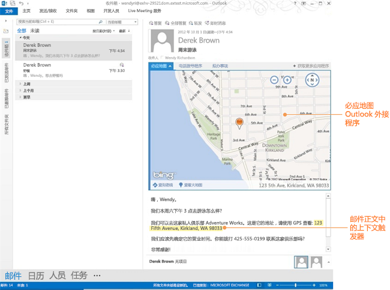
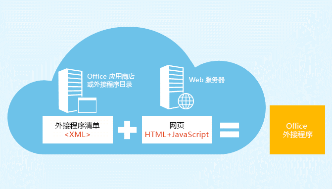

# Office 加载项平台概述

借助 Office 外接程序，您可以使用类似 HTML、CSS 和 JavaScript 的 Web 技术扩展 Office 客户端，如 Word、Excel 和 PowerPoint。 

您可以使用 Office 外接程序执行以下操作： 

-  **将新功能添加到 Office 客户端** - 例如，通过与 Office 文档和邮件项目交互、将外部数据引入 Office、处理 Office 文档和在 Office 客户端中公开第三方功能等，增强 Word、Excel、PowerPoint 和 Outlook 的功能。 
    
-  **新建可嵌入到 Office 文档的丰富、交互式对象** - 例如，用户可添加到其自己的 Excel 电子表格和 PowerPoint 演示文稿的地图、图表和交互式可视化效果。
    
**Office 外接程序在多个 Office 版本中运行**，包括 Windows 桌面版 Office、Office Online、Office for Mac 和 Office for iPad。

>**注意：**生成外接程序时，如果计划将外接程序[发布](../publish/publish.md)到 Office 应用商店，请务必遵循 [Office 应用商店验证策略](https://msdn.microsoft.com/en-us/library/jj220035.aspx)。例如，外接程序必须适用于支持你在清单内“要求”元素中定义的方法的所有平台，才能通过验证（见 [4.12 部分](https://msdn.microsoft.com/en-us/library/jj220035.aspx#Anchor_3)）。

有关 Office 外接程序当前受支持情况的简要视图，请参阅 [Office 外接程序主机和平台可用性](http://dev.office.com/add-in-availability)页。 

## Office 外接程序可以执行什么操作？

网页在浏览器中能做的事，Office 外接程序差不多都能做，如下所示：

- 通过创建自定义功能区按钮和选项卡扩展 Office 本机 UI。

- 通过 HTML 和 JavaScript 提供交互式 UI 和自定义逻辑。
    
- 使用 JavaScript 框架（如 jQuery、Angular 等）。
    
- 通过 HTTP 和 AJAX 连接到 REST 终结点和 Web 服务。
    
- 如果页面是使用服务器端脚本语言（如 ASP 或 PHP）实现的，则运行服务器端代码或逻辑。
    

此外，Office 外接程序可通过 Office 外接程序基础结构提供的 [JavaScript API](../../docs/develop/understanding-the-javascript-api-for-office.md) 与 Office 应用程序和外接程序用户的内容进行交互。 

## Office 外接程序的类型

您可以创建以下类型的 Office 外接程序：
 
- 扩展功能的 Word、Excel 和 PowerPoint 外接程序
- 新建对象的 Excel 和 PowerPoint 外接程序
- 扩展功能的 Outlook 外接程序

### 扩展功能的 Word、Excel 和 PowerPoint 外接程序 
您可以通过使用**任务窗格外接程序清单**注册外接程序，来向 Word、Excel 或 PowerPoint [添加新功能](../design/add-in-commands.md)。此清单支持**两种集成模式**：

- 外接程序命令
- 可插入的任务窗格

####外接程序命令
使用外接程序命令来扩展 Windows 桌面和 Office Online 的 Office UI。例如，您可以**在功能区上**或已选择的上下文菜单上为您的外接程序添加按钮，使用户可以轻松地访问其在 Office 中的外接程序。命令按钮可以启动不同操作，如**显示带有自定义 HTML 的一个窗格（或多个窗格）**或**执行一个 JavaScript 函数**。我们建议您[观看这段 Channel9 视频](https://channel9.msdn.com/events/Build/2016/P551)，更深层次地了解此功能。

**命令在 Excel Desktop 中运行的外接程序**

**命令在 Excel Online 中运行的外接程序**

可以通过使用 **VersionOverrides** 定义外接程序清单中的命令。Office 平台负责将其解释为本机 UI。若要开始执行此操作，请查看这些 [GitHub 上的示例](https://github.com/OfficeDev/Office-Add-in-Commands-Samples/)，并查看 [Excel、Word 和 PowerPoint 的外接程序命令](../design/add-in-commands.md)

####可插入的任务窗格
尚不支持外接程序命令的客户端（Office 2013、Office for Mac 和 Office for iPad）将使用清单中提供的 **DefaultUrl** 将外接程序作为**任务窗格**运行。然后，可以通过“插入”选项卡中的“**我的外接程序**”菜单启动外接程序。 

>**重要说明：**单个清单可同时拥有一个在不支持命令的客户端中运行的任务窗格外接程序和一个运行命令的版本。这样，您便可以拥有一个在支持 Office 外接程序的所有客户端中运行的单个外接程序。
 
###新建对象的 Excel 和 PowerPoint 外接程序 

使用内容外接程序清单来集成**可嵌入在文档内的基于 Web 的对象**。内容应用程序允许用户集成基于 Web 的丰富数据可视化内容、嵌入式媒体（例如，YouTube 视频播放器或图片库）以及其他外部内容。

**内容外接程序**

若要在 Excel 2013 或 Excel Online 中试用内容外接程序，请安装[必应地图](https://store.office.com/bing-maps-WA102957661.aspx?assetid=WA102957661)外接程序。

### 扩展功能的 Outlook 外接程序

Outlook 外接程序可扩展 Office 功能区，还可以在您查看或撰写 Outlook 项目时在其旁边的上下文中显示。它们可以在阅读模式（用户查看接收的项目）或在撰写模式（用户回复或创建新项目）中与电子邮件、会议请求、会议响应、会议取消或约会一起使用。 

Outlook 外接程序可以访问项目的上下文信息，如地址或跟踪 ID，然后使用该数据来访问服务器上的其他信息，并从 Web 服务创建极具吸引力的用户体验。在大多数情况下，Outlook 外接程序无需修改即可在各种支持的主机应用程序（包括 Outlook、Outlook for Mac、Outlook Web App 和适用于设备的 OWA）上运行，以提供在桌面、Web 以及平板电脑和移动设备上的无缝体验。

若要了解详细信息，请参阅 [Outlook 外接程序](../outlook/outlook-add-ins.md)。

 >**注意** Outlook 外接程序最低需要 Exchange 2013 或 Exchange Online 版本才能托管用户的邮箱。不支持 POP 和 IMAP 电子邮件帐户。

**功能区上具有命令按钮的 Outlook 外接程序**

**上下文 Outlook 外接程序**

若要尝试在 Outlook、Outlook for Mac 或 Outlook Web App 中使用 Outlook 外接程序，请安装 [程序包跟踪器](https://store.office.com/package-tracker-WA104162083.aspx?assetid=WA104162083)外接程序。

## Office 外接程序详解

Office 外接程序的基本组件是 XML 清单文件和您自己的 Web 应用程序。此清单定义各种设置，包括将外接程序与 Office 客户端集成的方式。需要在 Web 服务器或 Web 托管服务上托管您的 Web 应用程序，例如 [Microsoft Azure](../publish/host-an-office-add-in-on-microsoft-azure.md)。

**清单 + 网页 = Office 外接程序**

###清单

清单指定加载项的设置和功能，如下所示：
    
- 外接程序的显示名称、说明、ID、版本和默认区域设置。
    
- 如何将外接程序与 Office 集成：     
      - 对于扩展 Word/Excel/PowerPoint/Outlook 的外接程序：外接程序用来公开功能的本机扩展点，如功能区上的按钮。     
      - 对于新建嵌入对象的外接程序：对象加载的默认页面的 URL。
       
    
- 加载项的权限级别和数据访问要求。
    
有关详细信息，请参阅 [Office 外接程序 XML 清单](../../docs/overview/add-in-manifests.md)。

###Web 应用

兼容的 Web 应用的最低版本是静态 HTML 网页。页面可托管在任何 Web 服务器或 Web 托管服务上，例如 [Microsoft Azure](../publish/host-an-office-add-in-on-microsoft-azure.md)。您可以在选择的服务上托管 Web 应用。  

最基本的 Office 外接程序包括一个静态 HTML 页面，该页面在一个 Office 应用程序中显示，但不与 Office 文档或任何其他 Internet 资源交互。但是，因为它是 Web 应用程序，所以您可以使用您的托管提供程序所支持的所有客户端和服务器端技术（如 ASP.net、PHP 或 Node.js）。若要与 Office 客户端和文档交互，您可以使用我们提供的 office.js [JavaScript API](../../docs/develop/understanding-the-javascript-api-for-office.md)。 

**Hello World Office 外接程序的组件**

### JavaScript API

Word 和 Excel JavaScript API 提供可在 Office 外接程序中使用的特定于宿主的对象模型。这些 API 提供访问已知对象（如段落和工作簿）的权限，这样可以更轻松地为 Word 或 Excel 创建外接程序。若要了解这些 API 的详细信息，请参阅 [Word 外接程序](../word/word-add-ins-programming-overview.md)和 [Excel 外接程序](../excel/excel-add-ins-javascript-programming-overview.md)。

JavaScript API for Office 包含用于构建外接程序并与 Office 内容和 Web 服务交互的对象和成员。

有关适用于 Office 的 JavaScript API 的详细信息，请参阅 [了解适用于 Office 的 JavaScript API](../../docs/develop/understanding-the-javascript-api-for-office.md) 和 [适用于 Office 的 JavaScript API](../../reference/javascript-api-for-office.md) 参考。
    
## 其他资源

- [Office 外接程序的设计准则](../../docs/design/add-in-design.md)
    
- [API 参考](../../docs/develop/understanding-the-javascript-api-for-office.md)
    
