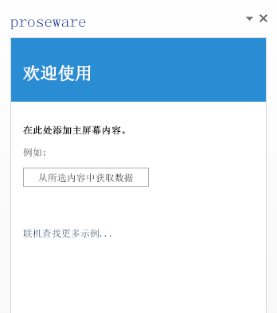

# 在 Microsoft Azure 上托管 Office 外接程序

最简单的 Office 外接程序由一个 XML 清单文件和一个 HTML 页组成。XML 清单文件介绍外接程序的特征，如名称、哪些 Office 客户端应用程序可在其中运行，以及外接程序的 HTML 页面的 URL。HTML 页包含在 Office 外接程序网站中，用户可以在安装并运行外接程序后查看页面并与之交互。 

可以将 Office 外接程序的网站承载于许多 Web 承载平台（包括 Azure）上。若要在 Azure 上承载 Office 外接程序，可将 Office 外接程序发布到 Azure 网站。 

此主题假定你没有使用 Azure 的经验。完成后，你可以将简单的 Office 外接程序的网站托管于 Azure 之上。你将了解：

- 如何向 Office 2013 添加受信任的外接程序目录
    
- 如何使用 Visual Studio 2015 或 Azure 管理门户在 Azure 中创建网站
    
- 如何向 Office 外接程序发布并将其托管在 Azure 网站上
    

**托管在 Azure 上的 Office 外接程序网站**

## 使用 .NET 的 Azure SDK、Azure 订阅和 Office 2013 来设置开发计算机

1. 从 [Azure 下载页](http://azure.microsoft.com/en-us/downloads/)安装适用于 .NET 的 Azure SDK。如果未安装 Visual Studio，则使用 SDK 安装适用于 Web 的 Visual Studio Express。
    
    - 在“**语言**”下，选择“** .NET**”。
    
    - 如果已安装 Visual Studio，则选择与 Visual Studio 版本匹配的 Azure .NET SDK 版本。
    
    - 如果系统询问是运行还是保存可执行安装文件时，请选择“**运行**”。
    
    - 在 Web 平台安装程序窗口中，选择“**安装**”。
    
2. 如果未安装 Office 2013，请安装。 
    
     >**注意：**你可以获取 [一个月试用版](http://office.microsoft.com/en-us/try/?WT%2Eintid1=ODC%5FENUS%5FFX101785584%5FXT104056786)。
3. 获取 Azure 帐户。
    
     >**注意：**如果是 MSDN 订阅者，[可以获取 Azure 订阅作为 MSDN 订阅的一部分](http://www.windowsazure.com/en-us/pricing/member-offers/msdn-benefits/)。如果不是 MSDN 订户，仍可以 [在 Microsoft Azure 网站获取免费试用版 Azure](https://azure.microsoft.com/en-us/pricing/free-trial/)。 

若要使演练简单易行并重点介绍使用 Azure 和 Office 外接程序，你可以将本地文件共享作为受信任的目录使用，可在其中存储外接程序的 XML 清单文件。对于打算在一个或多个业务中使用的外接程序，可在 SharePoint 中保留外接程序清单文件，或将外接程序发布到 Office 应用商店。 

## 步骤 1：创建网络文件共享以承载加载项清单文件

1. 在开发计算机上打开文件资源管理器（如果使用的是 Windows 7 或 Windows 的更早版本，则打开 Windows 资源管理器）。
    
2. 右键单击 C:\ 驱动器，然后选择“**新建**” > “**文件夹**”。
    
3. 将新文件夹命名为 AppManifestsAddinManifests。
    
4. 右键单击 AddinManifests 文件夹，然后选择“**共享**” > “**特定用户**”。
    
5. 在“**文件共享**”中，选择下拉箭头，然后选择“**所有人**” > “**添加**” > “**共享**”。
    

## 步骤 2：将文件共享添加到受信任的加载项目录，使 Office 客户端应用程序信任安装 Office 外接程序的位置

1.  启动 Word 2013 并创建文档。（尽管我们在本示例中使用的是 Word 2013，但你可以使用任何支持 Office 外接程序的 Office 应用程序，如 Excel、Outlook、PowerPoint 或 Project 2013。）
    
2.  选择“**文件**” > “**选项**”。
    
3.  在“**Word 选项**”中，选择“**信任中心**”，然后选择“**信任中心设置**”。 
    
4.  在“**信任中心**中，单击“**受信任的外接程序目录**”。输入之前创建的文件共享的通用命名约定 (UNC) 路径，作为**目录 URL**。例如，\\YourMachineName\AddinManifests。然后选择“**添加目录**”。 
    
5. 选中“**在菜单中显示**”复选框。将外接程序 XML 清单文件存储在受信任的外接程序目录的共享中时，外接程序将显示在“**Office 外接程序**”对话框中的“**共享文件夹**”下。
    

## 步骤 3. 在 Azure 中创建网站

可以使用多种方法创建空的 Azure 网站。如果使用的是 Visual Studio 2015，则按照[使用 Visual Studio 2015](../publish/host-an-office-add-in-on-microsoft-azure.md#using-visual-studio-2015) 中的步骤操作，从 Visual Studio IDE 中创建 Azure 网站。你也可以按照[使用 Azure 管理门户](../publish/host-an-office-add-in-on-microsoft-azure.md#using-the-azure-management-portal)中的步骤操作，创建 Azure 网站。

### 使用 Visual Studio 2015

1. 在 Visual Studio 的“**视图**”菜单中，选择“**服务器资源管理器**”。右键单击 **Azure** 并选择“**连接到 Microsoft Azure 订阅**”。请按说明连接到 Azure 订阅。
    
2. 在 Visual Studio 的“**服务器资源管理器**”中，展开“**Azure**”，右键单击“**App Service**”，然后选择“**创建新 Web 应用**”。
    
3. 在**在 Windows Azure 中创建 Web 应用**对话框中，提供此信息：
    
      - 为网站输入一个唯一的 **Web 应用名称**。Azure 将验证站点名称在整个 azurewebsites.net 域中是否是唯一的。
    
  - 选择你用于授权创建此网站的 **App Service 计划**。如果你创建一个新的计划，你还需要对其命名。
    
  - 为你的网站选择**资源组**。如果创建新组，你还需要对其命名。
    
  - 选择与你相应的地理**区域**。
    
  - 对于“**数据库服务器:**”，接受默认的“**无数据库**”设置，然后选择“**创建**”。
    

    新的网站出现在“**服务资源管理器**”中的“**Azure**”下的“**App Service**”下的所选资源组下。
    
4. 右键单击新网站，然后选择“**在浏览器中查看**”。浏览器打开并显示网页，同时显示消息“已成功创建此网站”。
    
5. 在浏览器地址栏中，更改网站的 URL，以便其使用 HTTPS，并按 **Enter** 确认已启用 HTTPS 协议。Office 外接程序模型要求外接程序使用 HTTPS 协议。
    
6. 在 Visual Studio 2015 中，右键单击“**服务器资源管理器**”中的新建网站，选择“**下载发布配置文件**”，然后将配置文件保存至计算机。发布配置文件包含凭据，使你可以执行 [步骤 5：将 Office 外接程序发布到 Azure 网站](../publish/host-an-office-add-in-on-microsoft-azure.md#step-5-publish-your-office-add-in-to-the-azure-website)。
    

### 使用 Azure 管理门户

1. 使用 Azure 帐户登录到 [Azure 管理门户](https://manage.windowsazure.com/)。
    
2. 选择“**新建**” > “**计算**” > “**WEB 应用**” > “**快速创建**”。 
    
3. 在“**URL**”下，输入唯一站点名称以完成网站的 URL。管理门户验证站点名称在整个 azurewebsites.net 域中是否是唯一的。
    
4. 选择与你网站相应的地理“**区域**”。
    
5. 选择“**创建 WEB 应用**”。Azure 管理门户将创建网站并重定向到“**网站**”页，可以在此页上查看网站的状态。
    
    当网站处于“**运行**”状态时，请在“**名称**”列下选择网站的 URL。浏览器会打开并显示带有“**Web 应用已创建!**”消息的网页。 
    
    在浏览器地址栏中，更改网站的 URL，以便其使用 HTTPS，并按 **Enter** 确认已启用 HTTPS 协议。Office 外接程序模型要求外接程序使用 HTTPS 协议。
    
6. 在“**Web 应用**”页上选择新网站。
    
7. 在“**发布你的应用**”下，选择“**下载发布配置文件**”以将发布配置文件保存至你的计算机。请记住文件名和位置，因为你需要在稍后使用它。
    
    发布配置文件包含你的凭据，使你可以安全地发布到 Azure。 
    

## 步骤 4：在 Visual Studio 中创建 Office 外接程序

1. 以管理员身份启动 Visual Studio。
    
2. 选择“**文件**” > “**新建**” > “**项目**”。
    
3. 在“**模板**”下，展开“**Visual C#**”（或“**Visual Basic**”），展开“**Office/SharePoint**”，然后选择“**Office 外接程序**”。
    
4. 选择“**Office 外接程序**”，然后选择“**确定**”以接受默认设置。
    
5. 显示“**创建 Office 外接程序**”后，保留任务窗格外接程序的默认选择，并选择“**下一步**”。
    
6. 在下一页，清除 Word 之外的所有复选框，然后选择“**完成**”。
    
现已创建基本的 Office 外接程序，并已准备好发布到 Azure。由于我们的重点是演示如何发布到 Azure，因此不要对使用 Visual Studio 中的标准 Office 外接程序模板创建的示例外接程序做出任何更改。

## 步骤 5：将 Office 加载项发布到 Azure 网站

1. 在 Visual Studio 中打开示例外接程序后，展开“**解决方案资源管理器**”中的解决方案节点，以便可以查看解决方案的两个项目。
    
2. 右键单击 Web 项目，然后选择“**发布**”。 
    
    Web 项目包含 Office 外接程序网站文件，因此，这是你可以发布到 Azure 的项目。
    
3. 在“**发布 Web**”中，选择“**导入**”。 
    
4. 在“**导入发布配置**”中，选择“**浏览**”，然后浏览到本主题前面保存发布配置文件的位置。选择“**确定**”以导入配置文件。
    
5. 在“**发布 Web**”中的“**连接**”选项卡上，接受默认设置并选择“**下一步**”。 
    
    再次选择“**下一步**”以接受默认设置。
    
6. 在“**预览**”选项卡上，选择“**开始预览**”。预览向你显示 Web 项目中将被发布到 Azure 网站的所有文件。
    
7. 选择“**发布**”。Visual Studio 会将 Office 外接程序的 Web 项目发布到 Azure 网站。 
    
8. Visual Studio 完成发布 Web 项目后，浏览器将打开并显示网页，其中显示“已成功创建此 Web 应用”文本。这是网站当前的默认页。
    
    若要查看你的外接程序的网页，请将 URL 更改为使用 https: 并添加你的外接程序的默认 HTML 页的路径。例如，已更改的 URL 应类似于 https://YourDomain.azurewebsites.net/Addin/Home/Home.html。这可确认你的外接程序的网站现在托管于 Azure 上。复制此 URL，因为稍后在本主题编辑外接程序清单文件时将需要此 URL。
    

## 步骤 6：编辑外接程序清单文件以指向 Azure 上的 Office 外接程序

1. 在示例 Office 外接程序在“**解决方案资源管理器**”中打开的 Visual Studio 中，展开该解决方案以显示两个项目。
    
2. 展开 Office 外接程序项目，例如 **OfficeAdd-in1**，右键单击清单文件夹，然后选择“**打开**”。显示外接程序清单属性页。
    
3. 对于“**源位置:**”，在发布外接程序后，输入上一步骤中复制的外接程序主要 HTML 页的 URL，例如，https://YourDomain.azurewebsites.net/Addin/Home/Home.html。 
    
4. 选择“**文件**”，然后选择“**保存所有**”。关闭外接程序清单属性页。
    
5. 返回到“**解决方案资源管理器**”，右键单击清单文件夹并选择“**在文件资源管理器中打开文件夹**”。
    
6. 复制外接程序清单文件，例如 OfficeAdd-in1.xml。 
    
7. 浏览到本主题前面创建的网络文件共享，并将清单文件粘贴到文件夹中。
    

## 步骤 7：在 Office 客户端应用程序中插入并运行加载项

1. 启动 Word 并打开一个新文档。
    
2. 在功能区上，选择“**插入**” > “**我的应用**”，然后选择“**查看全部**”。
    
3. 在“**Office 的应用**”对话框中，选择“**共享文件夹**”。与 Office 外接程序模型协同工作的 Office 客户端应用程序将扫描列为受信任的外接程序目录的文件夹，并在对话框中显示外接程序。你应该会看到示例外接程序的图标。
    
4. 为你的外接程序选择图标，然后选择“**插入**”。外接程序会插入到客户端应用程序的一侧。
    
5. 通过在文档中创建一些文本，然后选择文本，再选择“**从所选内容中获取数据**”，以测试外接程序是否正常运行。
    

## 其他资源

- [发布 Office 外接程序](../publish/publish.md)
    
- [使用 Napa 或 Visual Studio 打包外接程序以准备发布](../publish/package-your-add-in-using-napa-or-visual-studio.md)
    
