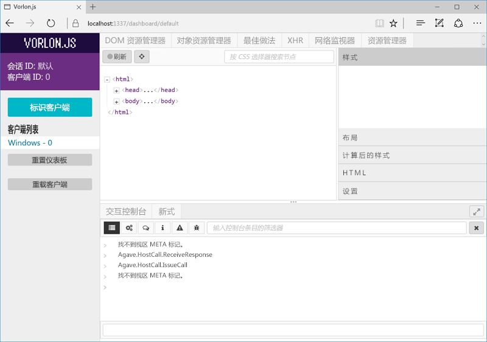

# 在 iPad 和 Mac 上调试 Office 外接程序

您可以使用 Visual Studio 开发和调试 Windows 上的外接程序。但是，无法使用它调试 iPad 或 Mac 上的外接程序。由于外接程序使用 HTML 和 Javascript 开发，它们应旨在跨平台工作，但不同浏览器呈现您的 HTML 的方式可能存在细微差异。本文介绍如何调试在 iPad 或 Mac 上运行的外接程序。 

## 使用 Vorlon.js 进行调试 

Vorlon.js 是网页的调试程序，与 F12 工具类似，它设计为远程工作，让您可以跨不同设备调试网页。有关详细信息，请参阅 [Vorlon 网站](http://www.vorlonjs.com)。  

安装和设置 Vorlon： 

1.  如果尚未安装，请安装 [Node.js](https://nodejs.org)。 

2.  通过以下命令使用 npm 安装 Vorlon：`sudo npm i -g vorlon` 

3.  使用命令 `vorlon` 运行 Vorlon 服务器。 

4.  打开浏览器窗口，然后转到 Vorlon 界面 [http://localhost:1337](http://localhost:1337)。

5.  向外接程序的 home.html 文件（或主 HTML 文件）的 `<head>` 部分添加以下脚本标记：
```    
<script src="http://localhost:1337/vorlon.js"></script>    
```  

>**注意：**你必须启用 Vorlon 中的 HTTPS 以使用 Vorlon.js 对外接程序进行调试。 若要了解如何执行此操作，请参阅 [调试 Office 外接程序的 VorlonJS 插件](https://blogs.msdn.microsoft.com/mim/2016/02/18/vorlonjs-plugin-for-debugging-office-addin/)。

现在，不管您何时在设备上打开外接程序，都会显示在 Vorlon 的客户端列表中（在 Vorlon 界面的左边）。您可以远程突出显示 DOM 元素、远程执行命令等。  



Office 外接程序的专用 Vorlon 插件可添加额外功能，如与 Office.js API 交互。有关详细信息，请参阅博客文章[用于调试 Office 外接程序的 VorlonJS 插件](https://blogs.msdn.microsoft.com/mim/2016/02/18/vorlonjs-plugin-for-debugging-office-addin/)。启用 Office 外接程序插件： 

1.  通过使用以下命令在本地克隆 Vorlon.js GitHub 存储库的开发分支： 
```
git clone https://github.com/MicrosoftDX/Vorlonjs.git
git checkout dev
npm install
```

2.  打开位于 /Vorlon/Server/config.json 的 **config.json** 文件。 若要激活 Office 外接程序插件，请将“**enabled**”属性设置为”**true**”。

 
