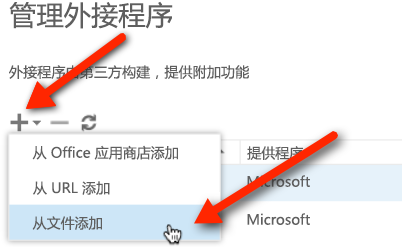

# 旁加载 Outlook 外接程序进行测试

你可以使用旁加载安装 Outlook 外接程序进行测试，无需首先将其置于外接程序目录中。

 >**注意**  还可以旁加载其他 Office 套件应用程序的外接程序。有关详细信息，请参阅 [旁加载 Office 外接程序以进行测试](create-a-network-shared-folder-catalog-for-task-pane-and-content-add-ins.md)。

## 旁加载 Outlook 外接程序

1. 转至 [Outlook Web App](https://outlook.office365.com)。
    
2. 选择右上部分的齿轮图标，然后选择“**管理外接程序**”。
    
    

3. 在“**管理外接程序**”页中，选择“**+**”图标，然后选择“**从文件添加**”。
    
    

4. 找到您的自定义外接程序清单文件并进行安装。在安装过程中接受所有提示。
    
完成后，选择现有的电子邮件，你将看到有一个水平条出现在电子邮件标题下面（其中包括外接程序）。接下来，创建一封电子邮件，然后选择“**外接程序**”（或“**应用**”）菜单项以显示任务窗格。选择该外接程序后，它将显示在任务窗格中。

    
