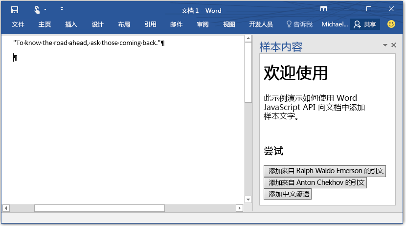

# <a name="build-your-first-word-add-in"></a>构建第一个 Word 外接程序

_适用于：Word 2016、Word for iPad、Word for Mac_

Word JavaScript API 是用于扩展 Office 应用程序的 Office 外接程序编程模型的一部分。外接程序编程模型使用 Web 应用程序托管您的 Word 扩展。现在您可以使用您喜欢的任何 Web 平台或语言扩展 Word。

Word 外接程序在 Word 内运行，并且可以使用 Word 2016 中的 Word JavaScript API 与文档内容交互。概括地说，创建外接程序分为两个部分：1) 可在任何位置托管的 Web 应用程序，以及 2) [外接程序清单](../../docs/overview/add-in-manifests.md)，Word 会使用该清单发现您的 Web 应用程序在何处托管（清单提供的功能不止于此，更多详情，请阅读[编程概述](word-add-ins-programming-overview.md)）。

>**Word 外接程序 = manifest.xml + Web 应用**

### <a name="set-it-up"></a>设置
在本部分中您将创建一个简单的 Web 应用程序和应用程序清单。Web 应用程序允许您在 Word 文档中添加样本文本。

1- 在本地驱动器上创建一个名为 BoilerplateAddin 的文件夹（例如 C:\\BoilerplateAddin）。将在后续步骤中创建的所有文件保存到此文件夹。

2- 为外接程序视图创建一个名为 home.html 的文件。外接程序将具有三个按钮，选中按钮时，将会添加样本文本。将以下代码粘贴到 home.html。

```html
    <!DOCTYPE html>
    <html>
      <head>
        <meta charset="UTF-8" />
        <meta http-equiv="X-UA-Compatible" content="IE=Edge" />
        <title>Boilerplate text app</title>
        <script src="https://ajax.aspnetcdn.com/ajax/jQuery/jquery-2.1.4.min.js"></script>
        <script src="https://appsforoffice.microsoft.com/lib/1/hosted/office.js" type="text/javascript"></script>
        <script src="home.js" type="text/javascript"></script>
        </head>
        <body>
            <div>
                    <h1>Welcome</h1>
            </div>
            <div>
                    <p>This sample shows how to add boilerplate text to a document by using the Word JavaScript API.</p>
                    <br />
                    <h3>Try it out</h3>
                    <button id="emerson">Add quote from Ralph Waldo Emerson</button>
                    <button id="checkhov">Add quote from Anton Chekhov</button>
                    <button id="proverb">Add Chinese proverb</button>
            </div>
            <h3><div id="supportedVersion"/></h3>
        </body>
    </html>
```

3- 创建一个名为 home.js 的文件并将下面的代码粘贴到该文件中。这包含初始化代码以及用于更改 Word 文档的所有外接程序代码。此代码将基于光标或 Word 文档中的选定内容插入文本。

```javascript
    (function () {
        "use strict";

        // The initialize function is run each time the page is loaded.
        Office.initialize = function (reason) {
            $(document).ready(function () {

                // Use this to check whether the API is supported in the Word client.
                if (Office.context.requirements.isSetSupported('WordApi', 1.1)) {
                    // Do something that is only available via the new APIs
                    $('#emerson').click(insertEmersonQuoteAtSelection);
                    $('#checkhov').click(insertChekhovQuoteAtTheBeginning);
                    $('#proverb').click(insertChineseProverbAtTheEnd);
                    $('#supportedVersion').html('This code is using Word 2016 or greater.');
                }
                else {
                    // Just letting you know that this code will not work with your version of Word.
                    $('#supportedVersion').html('This code requires Word 2016 or greater.');
                }
            });
        };

        function insertEmersonQuoteAtSelection() {
            Word.run(function (context) {

                // Create a proxy object for the document.
                var thisDocument = context.document;

                // Queue a command to get the current selection.
                // Create a proxy range object for the selection.
                var range = thisDocument.getSelection();

                // Queue a command to replace the selected text.
                range.insertText('"Hitch your wagon to a star."\n', Word.InsertLocation.replace);

                // Synchronize the document state by executing the queued commands,
                // and return a promise to indicate task completion.
                return context.sync().then(function () {
                    console.log('Added a quote from Ralph Waldo Emerson.');
                });
            })
            .catch(function (error) {
                console.log('Error: ' + JSON.stringify(error));
                if (error instanceof OfficeExtension.Error) {
                    console.log('Debug info: ' + JSON.stringify(error.debugInfo));
                }
            });
        }

        function insertChekhovQuoteAtTheBeginning() {
            Word.run(function (context) {

                // Create a proxy object for the document body.
                var body = context.document.body;

                // Queue a command to insert text at the start of the document body.
                body.insertText('"Knowledge is of no value unless you put it into practice."\n', Word.InsertLocation.start);

                // Synchronize the document state by executing the queued commands,
                // and return a promise to indicate task completion.
                return context.sync().then(function () {
                    console.log('Added a quote from Anton Chekhov.');
                });
            })
            .catch(function (error) {
                console.log('Error: ' + JSON.stringify(error));
                if (error instanceof OfficeExtension.Error) {
                    console.log('Debug info: ' + JSON.stringify(error.debugInfo));
                }
            });
        }

        function insertChineseProverbAtTheEnd() {
            Word.run(function (context) {

                // Create a proxy object for the document body.
                var body = context.document.body;

                // Queue a command to insert text at the end of the document body.
                body.insertText('"To know the road ahead, ask those coming back."\n', Word.InsertLocation.end);

                // Synchronize the document state by executing the queued commands,
                // and return a promise to indicate task completion.
                return context.sync().then(function () {
                    console.log('Added a quote from a Chinese proverb.');
                });
            })
            .catch(function (error) {
                console.log('Error: ' + JSON.stringify(error));
                if (error instanceof OfficeExtension.Error) {
                    console.log('Debug info: ' + JSON.stringify(error.debugInfo));
                }
            });
        }
    })();
```

4- 创建一个名为 BoilerplateManifest.xml 的 XML 文件并将下面的代码粘贴到该文件中。这是 Word 用于发现关于外接程序的信息（例如位置或显示名称）的清单文件。
```xml
<?xml version="1.0" encoding="UTF-8"?>
    <OfficeApp xmlns="http://schemas.microsoft.com/office/appforoffice/1.1"
               xmlns:xsi="http://www.w3.org/2001/XMLSchema-instance"
               xsi:type="TaskPaneApp">
        <Id>2b88100c-656e-4bab-9f1e-f6731d86e464</Id>
        <Version>1.0.0.0</Version>
        <ProviderName>Microsoft</ProviderName>
        <DefaultLocale>en-US</DefaultLocale>
        <DisplayName DefaultValue="Boilerplate content" />
        <Description DefaultValue="Insert boilerplate content into a Word document." />
        <Hosts>
            <Host Name="Document"/>
        </Hosts>
        <DefaultSettings>
            <SourceLocation DefaultValue="\\MyShare\boilerplate\home.html" />
        </DefaultSettings>
        <Permissions>ReadWriteDocument</Permissions>
    </OfficeApp>
```

5- 生成 GUID，并将 <code>OfficeApp/Id</code> 元素中的值替换为 GUID。

6- 保存所有文件。现在你已编写了第一个 Word 外接程序。

7- 将 home.js、home.html 和 BoilerplateManifest.xml 复制到 [网络上的共享文件夹](https://technet.microsoft.com/en-us/library/cc770880.aspx) (Windows) 或将其托管到本地服务器 (Mac) 上。

8- 编辑 BoilerplateManifest.xml 中的 [SourceLocation](../../reference/manifest/sourcelocation.md) 元素，使其指向 home.html 的位置。

现在，您已部署了第一个外接程序。现在，你需要让 Word 知道在哪里可以找到该外接程序。

#### <a name="try-this-out-in-word-2016-for-windows"></a>在 Windows 的 Word 2016 中尝试

1. 启动 Word，然后打开一个文档。
2. 选择**文件**选项卡，然后选择**选项**。
3. 选择**信任中心**，然后选择**信任中心设置**按钮。
4. 选择**受信任的外接程序目录**。
5. 在**目录 URL**框中，输入包含 BoilerplateManifest.xml 的文件夹共享的路径，然后选择**添加目录**。
6. 选中**显示在菜单中**复选框，然后单击**确定**。
7. 随后会出现一条消息，告知您下次启动 Office 时将应用您的设置。关闭并重新启动 Word。

现在您可以运行您创建的外接程序。请按照以下步骤查看其运行状况：

1. 打开一个 Word 文档。
2. 在 Word 2016 中的**插入**选项卡上，选择**我的外接程序**。
3. 选择**共享文件夹**选项卡。
4. 选择**样本内容**，然后选择**插入**。
5. 外接程序将加载在任务窗格中。参见图 1 查看其在加载时的外观。
6. 选择按钮以在 Word 文档中输入样本文本。


### <a name="try-it-out-in-word-2016-for-mac"></a>在 Word 2016 for Mac 中尝试一下

现在您可以运行您创建的外接程序。请按照以下步骤查看其运行状况：

1. 在 Users/Library/Containers/com.microsoft.word/Data/Documents/ 中创建一个名称为“wef”的文件夹
2. 将清单 BoilerplateManifest.xml 放入 wef 文件夹 (Users/Library/Containers/com.microsoft.word/Data/Documents/wef) 中
3. 打开 Mac 上的 Word 2016，并单击“插入”选项卡 >“我外接程序”下拉列表。您应该看到下拉列表中列出了该外接程序。选择该外接程序，它将加载该外接程序。

__图 1.在 Word 中加载的样本内容外接程序__


## <a name="give-us-your-feedback"></a>向我们提供反馈

您的反馈对我们意义重大。

* 查看文档并[提交问题](https://github.com/OfficeDev/office-js-docs/issues)，告诉我们您在其中发现的任何疑问和问题。
* 让我们了解您的编程体验、您希望在未来版本中看到的功能或代码示例。请在 [UserVoice 网站](http://officespdev.uservoice.com/)输入您的建议和想法。

## <a name="additional-resources"></a>其他资源

* [开始使用 Office 外接程序](https://dev.office.com/getting-started/addins?product=word)
* [GitHub 上的 Word 外接程序](https://github.com/OfficeDev?utf8=%E2%9C%93&query=Word)
