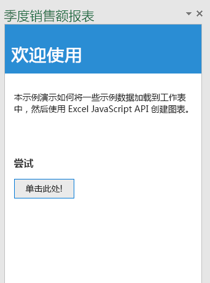

# 构建第一个 Excel 外接程序

_适用于：Excel 2016、Office 2016_

下面的步骤将引导您构建一个简单的任务窗格外接程序，该外接程序可将部分数据加载到工作表中并在 Excel 2016 中创建一个基本图表。


您需首先使用 HTML 和 JQuery 创建 Web 应用程序。然后创建 XML 清单文件，指定您希望将 Web 应用程序放置在何处，以及它在 Excel 中应该如何显示。 


### 编码

1- 在本地驱动器上创建一个名为 QuarterlySalesReport 的文件夹（例如 C:\\QuarterlySalesReport）。将在后续步骤中创建的所有文件保存到此文件夹。

2- 创建将加载到任务窗格外接程序的 HTML 页面。将文件命名为 **Home.html** 并将下面的代码粘贴到该文件中。

```html
	
	<!DOCTYPE html>
    <html>
    <head>
        <meta charset="UTF-8" />
        <meta http-equiv="X-UA-Compatible" content="IE=Edge" />
        <title>Quarterly Sales Report</title>   

        <script src="http://ajax.aspnetcdn.com/ajax/jQuery/jquery-2.1.4.min.js"></script>

        <link href="Office.css" rel="stylesheet" type="text/css" />

        <script src="https://appsforoffice.microsoft.com/lib/1.1/hosted/office.js" type="text/javascript"></script>

        <link href="Common.css" rel="stylesheet" type="text/css" />
        <script src="Notification.js" type="text/javascript"></script>

        <script src="Home.js" type="text/javascript"></script>

        <link rel="stylesheet" href="https://appsforoffice.microsoft.com/fabric/1.0/fabric.min.css">
        <link rel="stylesheet" href="https://appsforoffice.microsoft.com/fabric/1.0/fabric.components.min.css">

    </head>
    <body class="ms-font-m">
        <div id="content-header">
            <div class="padding">
                <h1>Welcome</h1>
            </div>
        </div>
        <div id="content-main">
            <div class="padding">
                <p>This sample shows how to load some sample data into the worksheet, and then create a chart using the Excel JavaScript API.</p>
                <br />
                <h3>Try it out</h3>
                <button class="ms-Button" id="load-data-and-create-chart">Click me!</button>
            </div>
        </div>
    </body>
    </html>	

```  

3- 创建一个名为 **Common.css** 的文件用于存储自定义样式并将下面的代码粘贴到该文件中。

```css
	/* Common app styling */

    #content-header {
        background: #2a8dd4;
        color: #fff;
        position: absolute;
        top: 0;
        left: 0;
        width: 100%;
        height: 80px; /* Fixed header height */
        overflow: hidden; /* Disable scrollbars for header */
    }

    #content-main {
        background: #fff;
        position: fixed;
        top: 80px; /* Same value as #content-header's height */
        left: 0;
        right: 0;
        bottom: 0;
        overflow: auto; /* Enable scrollbars within main content section */
    }

    .padding {
        padding: 15px;
    }

    #notification-message {
        background-color: #818285;
        color: #fff;
        position: absolute;
        width: 100%;
        min-height: 80px;
        right: 0;
        z-index: 100;
        bottom: 0;
        display: none; /* Hidden until invoked */
    }

        #notification-message #notification-message-header {
            font-size: medium;
            margin-bottom: 10px;
        }

        #notification-message #notification-message-close {
            background-image: url("../Images/Close.png");
            background-repeat: no-repeat;
            width: 24px;
            height: 24px;
            position: absolute;
            right: 5px;
            top: 5px;
            cursor: pointer;
        }

	
```

4- 创建一个包含 jQuery 中的外接程序编程逻辑的文件。将文件命名为 **Home.js** 并将下面的脚本粘贴到该文件中。
	
```js
    
    (function () {
        "use strict";

        // The initialize function must be run each time a new page is loaded
        Office.initialize = function (reason) {
            $(document).ready(function () {
                app.initialize();

                $('#load-data-and-create-chart').click(loadDataAndCreateChart);
            });
        };

        // Load some sample data into the worksheet and then create a chart
        function loadDataAndCreateChart() {
            // Run a batch operation against the Excel object model
            Excel.run(function (ctx) {

                // Create a proxy object for the active worksheet
                var sheet = ctx.workbook.worksheets.getActiveWorksheet();

                //Queue commands to set the report title in the worksheet
                sheet.getRange("A1").values = "Quarterly Sales Report";
                sheet.getRange("A1").format.font.name = "Century";
                sheet.getRange("A1").format.font.size = 26;

                //Create an array containing sample data
                var values = [["Product", "Qtr1", "Qtr2", "Qtr3", "Qtr4"],
                              ["Frames", 5000, 7000, 6544, 4377],
                              ["Saddles", 400, 323, 276, 651],
                              ["Brake levers", 12000, 8766, 8456, 9812],
                              ["Chains", 1550, 1088, 692, 853],
                              ["Mirrors", 225, 600, 923, 544],
                              ["Spokes", 6005, 7634, 4589, 8765]];

                //Queue a command to write the sample data to the specified range
                //in the worksheet and bold the header row
                var range = sheet.getRange("A2:E8");
                range.values = values;
                sheet.getRange("A2:E2").format.font.bold = true;

                //Queue a command to add a new chart
                var chart = sheet.charts.add("ColumnClustered", range, "auto");

                //Queue commands to set the properties and format the chart
                chart.setPosition("G1", "L10");
                chart.title.text = "Quarterly sales chart";
                chart.legend.position = "right"
                chart.legend.format.fill.setSolidColor("white");
                chart.dataLabels.format.font.size = 15;
                chart.dataLabels.format.font.color = "black";
                var points = chart.series.getItemAt(0).points;
                points.getItemAt(0).format.fill.setSolidColor("pink");
                points.getItemAt(1).format.fill.setSolidColor('indigo');

                //Run the queued commands, and return a promise to indicate task completion
                return ctx.sync();
            })
              .then(function () {
                  app.showNotification("Success");
                  console.log("Success!");
              })
            .catch(function (error) {
                // Always be sure to catch any accumulated errors that bubble up from the Excel.run execution
                app.showNotification("Error: " + error);
                console.log("Error: " + error);
                if (error instanceof OfficeExtension.Error) {
                    console.log("Debug info: " + JSON.stringify(error.debugInfo));
                }
            });
        }
    })();
```


5- 创建一个包含用于在出现错误时在外接程序中提供通知的编程逻辑的文件。这在调试时很有用。将文件命名为 **Notification.js** 并将下面的脚本粘贴到该文件中。
	
```js
    
    /* Notification functionality */

    var app = (function () {
        "use strict";

        var app = {};

        // Initialization function (to be called from each page that needs notification)
        app.initialize = function () {
            $('body').append(
                '<div id="notification-message">' +
                    '<div class="padding">' +
                        '<div id="notification-message-close"></div>' +
                        '<div id="notification-message-header"></div>' +
                        '<div id="notification-message-body"></div>' +
                    '</div>' +
                '</div>');

            $('#notification-message-close').click(function () {
                $('#notification-message').hide();
            });


            // After initialization, expose a common notification function
            app.showNotification = function (header, text) {
                $('#notification-message-header').text(header);
                $('#notification-message-body').text(text);
                $('#notification-message').slideDown('fast');
            };
        };

        return app;
    })();
```

6- 创建一个 XML 清单文件，以指定您的 Web 应用程序放置在何处以及您希望其在 Excel 中如何显示。将文件命名为 **QuarterlySalesReportManifest.xml** 并将以下 XML 粘贴到该文件中。
    
	```xml
	<?xml version="1.0" encoding="UTF-8"?>
    <!--Created:cb85b80c-f585-40ff-8bfc-12ff4d0e34a9-->
    <OfficeApp xmlns="http://schemas.microsoft.com/office/appforoffice/1.0" xmlns:xsi="http://www.w3.org/2001/XMLSchema-instance" xsi:type="TaskPaneApp">
      <Id>ab2991e7-fe64-465b-a2f1-c865247ef434</Id>
      <Version>1.0.0.0</Version>
      <ProviderName>Microsoft</ProviderName>
      <DefaultLocale>en-US</DefaultLocale>
      <DisplayName DefaultValue="Quarterly Sales Report Sample" />
      <Description DefaultValue="Quarterly Sales Report Sample"/>
      <Capabilities>
        <Capability Name="Workbook" />
      </Capabilities>
      <DefaultSettings>
        <SourceLocation DefaultValue="\\MyShare\QuarterlySalesReport\Home.html" />
      </DefaultSettings>
      <Permissions>ReadWriteDocument</Permissions>
    </OfficeApp>
	```

7- 使用您选择的在线生成器生成 GUID。然后将前一步中显示的 **Id** 标记中的值替换为该 GUID。 

8-	保存所有文件。您现在已编写了第一个 Excel 外接程序。 

### 尝试一下

部署和测试外接程序最简单的方法是将文件复制到网络共享。

1- 在网络共享上创建一个文件夹（例如 \\\MyShare\\QuarterlySalesReport）并将所有文件复制到该文件夹中。  

2- 编辑清单文件的 **SourceLocation** 元素，使其指向步骤 1 中的 .html 页面的共享位置。 

3-  将清单 (QuarterlySalesReportManifest.xml) 复制到网络共享（例如 \\\MyShare\\MyManifests）。

4- 添加包含清单作为 Excel 中的可信应用程序目录的清单的共享位置。

      a-  Launch Excel and open a blank spreadsheet.  
    
      b-  Choose the **File** tab, and then choose **Options**.
    
      c-  Choose **Trust Center**, and then choose the **Trust Center Settings** button.
    
      d-  Choose **Trusted Add-in Catalogs**.
    
      e-  In the **Catalog Url** box, enter the path to the network share you created in step 3, and then choose **Add Catalog**.
    
      f-  Select the **Show in Menu** check box, and then choose **OK**. A message appears to inform you that your settings will be applied the next time you start Office. 
        
5- 测试并运行外接程序。 

      a-  On the **Insert tab** in Excel 2016, choose **My Add-ins**. 
      
      b-  In the **Office Add-ins** dialog box, choose **Shared Folder**.
      
      c-  Choose **Quarterly Sales Report Sample**>**Insert**. The add-in opens in a task pane to the right of the current worksheet, as shown in the following figure.
 
 
   
      d-  Click the **Click me!** button to render the data and the chart inside the worksheet, as shown in the following figure.  To see the chart update dynamically, just change the data in the range. 
        


### 其他资源
 

*  [Excel 外接程序编程概述](excel-add-ins-programming-overview.md)
*  [适用于 Excel 的代码段资源管理器](http://officesnippetexplorer.azurewebsites.net/#/snippets/excel)
*  [Excel 外接程序代码示例](excel-add-ins-code-samples.md) 
*  [Excel 外接程序 JavaScript API 参考](excel-add-ins-javascript-reference.md)
